# Protocol Architecture

**Vayyl, Confidential Settlement Infrastructure for Stellar**

Groth16 over BN254 · Poseidon2 · BabyJubjub · verified natively on Soroban

> **Status legend.** ✅ **Live**, deployed and verified on-chain. 🔨 **Built**, implemented and tested in-repository, deployment sequenced. 📐 **Specified**, designed to circuit/interface level, not yet implemented. 🔬 **Research**, named track, no delivery date claimed.
>
> Every claim below traces to a contract ID, a transaction hash, a Circom source file, a Stellar CAP, or a cited external protocol. Where something is designed but not deployed, this document says so.

**Contents**

1. Why this is possible now · 2. The global privacy landscape · 3. System overview · 4. Cryptographic foundation · 5. The note primitive · 6. Accumulator design · 7. Contracts · 8. Circuits · 9. Private payments · 10. Compliance · 11. Private positions · 12. Hidden orders · 13. Agentic settlement · 14. The Vayyl SDK · 15. Note discovery · 16. Services · 17. Client and proving · 18. Cost and limits · 19. Security · 20. Privacy model · 21. **Gap analysis, what we do not yet use** · 22. Roadmap · 23. Deployments · 24. References

**Diagrams**

| § | Diagram | § | Diagram |
|---|---|---|---|
| 3 | Layer stack | 13 | Confidential x402 settlement |
| 3.1 | System context and actors | 14.2 | SDK package graph |
| 5.1 | Key derivation hierarchy | 15 | Note discovery, scan vs FMD |
| 5.2 | Note lifecycle state machine | 16 | Off-chain service data flow |
| 6.1 | Merkle frontier insertion | 17.1 | Proving pipeline, end to end |
| 9.1 | Shield sequence | 19.1 | Trust boundaries |
| 9.2 | Private transfer + ECDH discovery | 22.1 | Batch disbursement |
| 9.3 | Unshield + front-running defeat | | |
| 9.4 | Exit paths, private vs rage-quit | | |
| 11.5 | Position lifecycle end to end | | |
| 11.8 | Liquidation state machine | | |
| 12 | Hidden order lifecycle | | |

---

## 1. Why this is possible now, and was not before

Stellar is a public ledger. Every payment, balance, and counterparty is visible to anyone, permanently. That transparency makes the network verifiable, and it has kept payroll, treasury operations, institutional settlement, and every position-bearing strategy off it.

Stellar's own documentation states the problem:

> *"Stellar is a public blockchain: every transaction is recorded onchain and visible to anyone. This transparency enables permissionless validation, but many real-world use cases (payroll, institutional settlement, everyday payments) require transaction privacy."*
>, [Privacy on Stellar](https://developers.stellar.org/docs/build/apps/privacy)

Solving it requires verifying a zero-knowledge proof on-chain. Until 2026 that was unaffordable on Soroban, pairing arithmetic in WASM exceeds any sane instruction budget. Five protocol changes moved the boundary:

| CAP | What it added | Status | Protocol |
|---|---|---|---|
| [CAP-0059](https://github.com/stellar/stellar-protocol/blob/master/core/cap-0059.md) | BLS12-381 curve operations | Final | 22 |
| [**CAP-0074**](https://github.com/stellar/stellar-protocol/blob/master/core/cap-0074.md) | **BN254 host functions**, `bn254_g1_add`, `bn254_g1_mul`, `bn254_multi_pairing_check`, mirroring Ethereum's EIP-196/197 precompiles | **Final** | **25** |
| [**CAP-0075**](https://github.com/stellar/stellar-protocol/blob/master/core/cap-0075.md) | **Poseidon / Poseidon2 permutation primitives** | **Final** | **25** |
| [CAP-0080](https://github.com/stellar/stellar-protocol/blob/master/core/cap-0080.md) | Host functions for *efficient* ZK BN254 use cases | Implemented | 26 |
| [CAP-0082](https://github.com/stellar/stellar-protocol/blob/master/core/cap-0082.md) | Checked 256-bit integer arithmetic | Implemented | 26 |

Protocol 25 (**X-Ray**) activated on mainnet **22 January 2026**. Protocol 26 (**Yardstick**) followed.

CAP-0074 is the pivotal one. BN254 is the curve Circom, snarkjs, Barretenberg, and RISC Zero's Groth16 wrapper target by default. Stellar's docs put it precisely: *"Existing BN254-based circuits and tooling can be ported to Stellar without modification."* The global ZK toolchain became addressable from Soroban in one upgrade.

And SDF is equally precise about what the primitives are **not**:

> *"These primitives are foundational building blocks and do not, on their own, provide end-to-end private payments without additional higher-level protocol or application logic."*
>, [ZK Proofs on Stellar](https://developers.stellar.org/docs/build/apps/zk)

**That higher-level protocol logic is what Vayyl is.** The foundation shipped primitives in January. We shipped the protocol that turns them into working confidential settlement (to mainnet) in July.

### 1.1 The curve decision, and why most of the ecosystem is on the wrong one

Pre-Protocol-25 guidance told Stellar developers to compile Circom with `-p bls12381`, because BN254 could not be verified on-chain. That guidance is obsolete, and much ecosystem tooling has not caught up. SDF's own Privacy Pools prototype is BLS12-381, where a single pairing check consumes roughly **40% of the testnet instruction budget**.

Vayyl is BN254 end to end, with no reference implementation to copy, the verifier is written directly against the CAP-0074 host functions. Three consequences:

1. **The entire Circom/snarkjs ecosystem works unmodified.** No curve-porting tax on every circuit.
2. **Verification is dramatically cheaper** (§18).
3. **Proofs are portable.** A Vayyl proof is an ordinary BN254 Groth16 proof, the same artifact verifies on Ethereum, on any EVM L2, and on Stellar. This is the foundation of cross-chain confidential settlement (§22.3) and BLS12-381 designs do not have it.

---

## 2. Where Vayyl sits in the global privacy landscape

We did not invent shielded pools. We studied every serious production implementation across six chains, took what works, and rejected what does not fit Soroban's cost model. This section is the evidence of that work.

### 2.1 The taxonomy: three distinct things people call "privacy"

SDF publishes a [working taxonomy](https://stellar.org/blog/developers/developer-preview-confidential-tokens-on-stellar) that is worth internalizing, because being compared to the wrong category is a real risk:

| Approach | Public | Private | Example |
|---|---|---|---|
| **Confidential balances** | Sender and recipient addresses | Balances, transfer amounts | Solana Token-2022, Stellar Confidential Tokens |
| **Shielded pool** | Deposit and withdrawal addresses | Sender, recipient, amounts, and the **graph** inside the pool | Zcash, Tornado, Railgun, Aztec, **Vayyl** |
| **Standard tokens** | Everything | Nothing | SEP-41, SPL |

**Vayyl hides the transaction graph.** Confidential-balance systems hide amounts while leaving the graph fully legible. They are complementary, not competing, and the distinction matters because they defend against entirely different adversaries.

### 2.2 Prior art studied, and what we took from each

| Protocol | Chain | Proof system | Key architectural idea | Adopted by Vayyl? |
|---|---|---|---|---|
| **Zcash** (Sapling/Orchard) | Zcash | Groth16 → Halo2 | Note commitments + nullifiers; **hierarchical viewing keys** ([ZIP-316](https://zips.z.cash/zip-0316)) | Core model ✅ · viewing-key hierarchy §21.3 |
| **Tornado Cash** | Ethereum | Groth16 / BN254 | **Fixed denominations** collapse amount correlation | ✅ Adopted, V2 is fixed-denomination |
| **Privacy Pools** (Buterin, Illum, Nadler, Schär, Soleimani) | Ethereum | Groth16 | **Association Set Providers**, prove membership of an approved set in ZK | ✅ Core of our compliance layer |
| **0xbow** | Ethereum | Groth16 | First production ASP deployment; **rage-quit** public exit | ✅ Both adopted |
| **Railgun** | Ethereum | Groth16 | Encrypted notes; **Private Proofs of Innocence** | Partially, PPOI-style attestation is §21.8 |
| **Aztec** | Aztec | PLONK/Honk | **Indexed Merkle tree** for nullifiers (cheap non-membership proofs | ❌ Not yet) **top gap**, §21.2 |
| **Namada** | Namada | Groth16 | **MASP** (one unified anonymity set across *all* assets | ❌ Deliberate divergence) §21.5 |
| **Penumbra** | Penumbra | Groth16 | **Fuzzy Message Detection** in production (scalable note discovery | ❌ Not yet) **top gap**, §21.1 |
| **Solana Token-2022** | Solana | ElGamal + Bulletproofs | Native confidential-transfer program, auditor keys | Different category (§2.1) |
| **Arcium** | Solana | MPC (Manticore) | Confidential *computation* over token state, not just transfers | 🔬 Informs dark-pool track |
| **SDF Privacy Pools prototype** | Stellar | Groth16 / **BLS12-381** | Official reference; ~40% instruction budget per pairing | Validation of the primitive |
| **Nethermind Stellar Private Payments** | Stellar | n/a | Active official-adjacent implementation (55★, commits Aug 2026) | Prior art, monitored |
| **xBull Mixer** | Stellar | **UltraHonk** + Poseidon2 | **KYT transaction monitoring** as the compliance layer | Compliance depth, §21.11 |
| **Fairblock** | Stellar | Threshold encryption | Sealed-bid auctions, confidential transfers | 🔬 Integration candidate, §21.9 |
| **Sanctum** (zkbricks) | Stellar | ZK + MPC | Contracts computing on secret state | 🔬 Research track |
| **Arcane** (SCF #42) | Stellar | Not published | Compliance-ready privacy **infrastructure** for institutions | Closest positioning, §2.4 |
| **LumenShade** (SCF #37) | Stellar | Not published | Privacy-pools **application** with regulatory transparency | Same primitive, different layer, §2.4 |
| **Moonlight** (SCF #37) | Stellar | Not published | Non-custodial ZK confidential transfers with compliance hooks | Payments-only scope, §2.4 |

### 2.3 Where Vayyl is genuinely ahead

From SDF's own published "remaining work" list on their prototype:

| Capability | SDF prototype | **Vayyl** |
|---|---|---|
| Front-running protection (recipient bound into proof) | ❌ *"not yet implemented in main.circom"* | ✅ Live |
| Multiple historical roots (concurrent deposits) | ❌ listed as remaining work | ✅ 32-root ring buffer |
| Shielded→shielded transfer | ❌ deposit/withdraw only | ✅ **Verified on-chain** |
| Curve / tooling alignment | BLS12-381 | BN254 |
| Cost | ~40% instruction budget | 0.155–0.179 XLM **measured on mainnet** |
| **Deployed to mainnet** | ❌ | ✅ **11 July 2026** |

And the position that no other Stellar privacy effort occupies: **a shielded pool is table stakes. A confidential settlement layer that composes (payments, positions, orders, and agentic settlement over one primitive, with compliance built in) is the product.**

### 2.4 Vayyl against the funded Stellar privacy cohort

Stellar privacy is not an empty field, and pretending otherwise would be the wrong way to argue for building here. Arcane, LumenShade, and Moonlight have all been funded, and all three describe compliant confidential transfers. Three honest distinctions, each checkable rather than rhetorical.

**We are a verification layer, not a privacy application.** All three occupy the application or infrastructure tier. Vayyl's load-bearing component is L1 in §3: one `Groth16Verifier` holding a `CircuitId → VerificationKey` registry that **any** Soroban contract can call. Adding a confidential capability means writing a circuit and registering a key, not deploying verification infrastructure. That is why §14.4 lets an external lending protocol consume a Vayyl solvency proof without any ZK capability of its own. A privacy product that only serves its own front end cannot do this, regardless of how good its circuits are.

**We are building past payments onto the same primitive.** Confidential transfers are where the cohort stops. Vayyl reuses one note, nullifier, and Merkle accumulator for payments (§9, live), directional positions with a reserving counterparty vault (§11), hidden conditional orders (§12), and agentic settlement (§13). Whether that breadth is a strength is a fair question, and §11.9 and §21 state plainly what is unfinished. But it is a different architecture, not a different marketing frame.

**Our costs are published and reproducible.** §18.1 gives measured mainnet figures: deposit 1,548,279 stroops, withdrawal 1,790,526 stroops, against a 400,000,000 instruction budget, with the transaction hashes in §23. As of August 2026 we have not found equivalent published per-transaction figures from the projects above. If they exist we will cite them, because the ecosystem needs the comparison more than we need to be the only source of it.

What we do **not** claim: that we are further along commercially, that our compliance design is more rigorous than a KYT-based approach like xBull's, or that a broad scope is automatically better than a narrow well-executed one. Those are open questions and we would rather state them than lose them.

---

## 3. System overview

Six layers, each independently testable, each depending only on the layer beneath.

```
┌──────────────────────────────────────────────────────────────────┐
│ L5  CLIENT        Browser DApp · Freighter · Web Worker proving  │
│                   IndexedDB note vault · encrypted backup        │
├──────────────────────────────────────────────────────────────────┤
│ L4  SERVICES      Indexer · Relayer · Oracle adapter · Keeper    │
│                   Proof bridge (snarkjs JSON → Soroban binary)   │
├──────────────────────────────────────────────────────────────────┤
│ L3  APPLICATION   PositionManager · LiquidationEngine            │
│                   HiddenOrderRegistry · AgenticSettlementHub     │
├──────────────────────────────────────────────────────────────────┤
│ L2  CORE          VayylPool (per asset) · VayylPoolFactory       │
│                   ASPMembership · ASPNonMembership · Vault       │
├──────────────────────────────────────────────────────────────────┤
│ L1  VERIFICATION  Groth16Verifier — CircuitId → VerificationKey  │
│                   ONE registry, callable by any Soroban contract │
├──────────────────────────────────────────────────────────────────┤
│ L0  STELLAR       bn254_g1_add · bn254_g1_mul                    │
│                   bn254_multi_pairing_check · Poseidon2          │
│                   Stellar Asset Contract · Reflector SEP-40      │
└──────────────────────────────────────────────────────────────────┘
```

### 3.1 System context

Who talks to what, and where the trust boundaries fall.

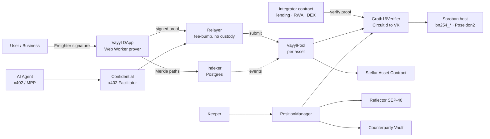

The load-bearing decision is **L1**. Every circuit in the system verifies through **one** `Groth16Verifier` holding a `CircuitId → VerificationKey` registry. Adding a confidential capability means writing a circuit and registering a key, not deploying new verification infrastructure.

That is what makes Vayyl a *layer* rather than an application, and why an external Soroban protocol can consume Vayyl proofs without any ZK capability of its own (§14).

---

## 4. Cryptographic foundation

Four locked choices, mutually reinforcing. Deviating from one breaks the others.

| Component | Choice | Rationale |
|---|---|---|
| Proving system | **Groth16** | 256-byte constant proofs, constant-time verification, one pairing check |
| Curve | **BN254** | Native via CAP-0074; Circom/snarkjs default; EVM-portable |
| Hash | **Poseidon2 only** | ~8 constraints/element vs ~25,000 for SHA-256 in-circuit; native permutation via CAP-0075 |
| Key agreement | **BabyJubjub** | Twisted Edwards over BN254's scalar field, *circuit-native*. secp256k1 would inflate constraints ~60× |

### 4.1 Why Groth16 and not PLONK or Halo2: a decision we can defend

Groth16's cost is a **per-circuit trusted setup**. PLONK offers a universal, updatable KZG setup reusable across circuits; Halo2 eliminates trusted setup entirely via an inner-product argument. Both are attractive, and we evaluated both.

We chose Groth16 for a Soroban-specific reason: **verification cost and proof size dominate everything on-chain.**

| System | Setup | Proof size | On-chain verification | Fit for Soroban |
|---|---|---|---|---|
| **Groth16** | Per-circuit ceremony | **~256 bytes** | **One** multi-pairing check | ✅ Cheapest possible |
| PLONK | Universal (KZG) | ~500 B–1 KB | More pairings + scalar mults | Viable, measurably costlier |
| Halo2 (IPA) | **None** | **Tens–hundreds of KB** | No pairing, heavy MSM | ❌ Against `tx_max_size_bytes = 132,096` |
| STARKs | None, post-quantum | 10–100× larger | Very heavy | ❌ |

Halo2's proof sizes alone can approach Stellar's maximum transaction size. Groth16's flat single-pairing verification is precisely what produces the $0.03 figure in §18.

**The trade we accepted is a real one, and we own it:** Groth16 requires a per-circuit ceremony, so a multi-party Phase-2 is a hard prerequisite to mainnet at scale (§19.4). We would rather run a ceremony than pay 10× per transaction forever. If CAP-0080 materially changes the MSM cost profile, PLONK becomes worth re-evaluating for future circuits, and because every circuit resolves through one verifier, that evaluation is contained (§21.10).

### 4.2 Poseidon V1 is banned

Poseidon V1 has a disclosed vulnerability (**CVE-2026-32129**): zero-padding produces collisions on variable-length inputs. In a commitment scheme, a collision is a forged note.

`circomlib/circuits/poseidon.circom` is **never** imported. `circomlib` is used only for BabyJubjub point operations (`EscalarMul`, `EscalarMulFix`, `BabyAdd`) and `Num2Bits` range decomposition.

### 4.3 Parameter parity is enforced, not assumed

CAP-0075 exposes the Poseidon2 **permutation** with state size, rounds, MDS matrix, and round constants all **caller-supplied**. There are no host-fixed parameters. The authority is the vendored `rs-soroban-poseidon` crate, and Circom must match it exactly.

A mismatch does not error, it produces proofs that are internally valid and never verify on-chain. Silent, and brutal to diagnose post-deployment. Our controls:

- Parameters pinned in a canonical reference document, published alongside this one
- Eight test vectors asserted in both the Rust crate and the Circom suite
- Circom **differentially verified** against the Rust host on every build

---

## 5. The note primitive

Every payment, position, and order in Vayyl is one primitive reused.

```
privKey     ∈ [1, l)           secret scalar, never leaves the device
(pubX,pubY) = privKey · Base8  BabyJubjub public key — DERIVED, never supplied
commitment  = Poseidon2(pubX, pubY, amount, blindness)
nullifier   = Poseidon2(commitment, privKey)
ASP_leaf    = Poseidon2(pubX, pubY)
```

### 5.1 Key derivation hierarchy

Everything descends from one wallet signature, so a user's shielded identity is recoverable from their Stellar wallet alone. Dashed nodes are the planned hierarchical extension (§21.3).

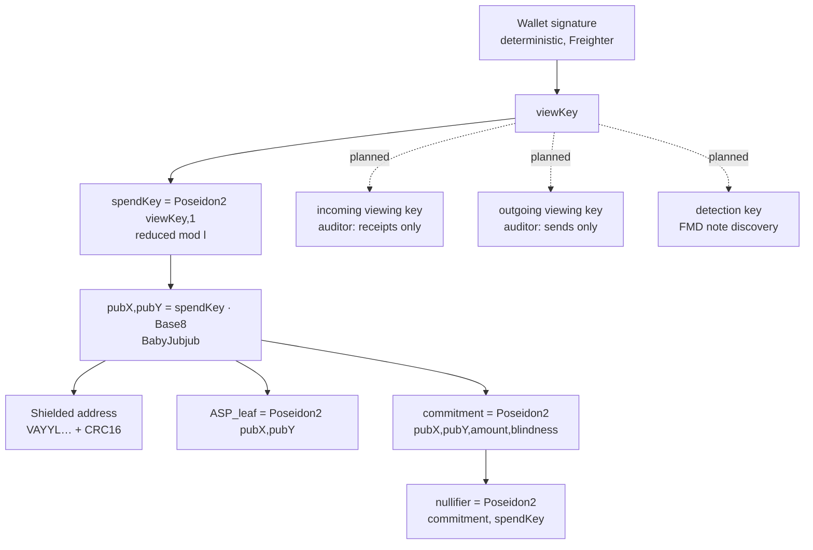

A commitment is **hiding** and **binding**. A nullifier is deterministic per note yet reveals nothing about which commitment produced it. Spending publishes the nullifier and proves in zero knowledge that some commitment in the tree opens to it.

**The single most important constraint in the system is that `(pubX, pubY)` is derived from `privKey` inside the circuit and never accepted as free input.** If a prover chooses the public key independently, one note yields unlimited distinct nullifiers and the pool drains. This is the bug class that has killed multiple shielded-pool deployments industry-wide.

`Note()` (`circuits/lib/note.circom`) enforces it, plus two conditions naive derivation misses:

- **`privKey ∈ [1, l)`**, where `l ≈ 2^251.3` is the `Base8` subgroup order, via `Num2Bits(251)` + `LessThan(251)` + non-zero check. Without this bound, `privKey` and `privKey + k·l` produce an *identical* public key, commitment, and ASP leaf but a *different* nullifier. We measured **six valid witnesses per note** before closing it.
- **Spend keys reduced mod `l`.** A key derived as `Poseidon2(viewKey, 1)` reaches ~2^254 and overflows the bit decomposition. On 200 sampled keys, **69 hard-failed witness generation**, roughly 34% of users silently unable to deposit.

Neither was found by inspection. Both were found by **differential testing against compiled circuit witnesses**, and both carry regression tests.

### 5.2 Note lifecycle

One note, five terminal states. Every transition publishes exactly one nullifier, which is what makes double-spend prevention and unlinkability the same mechanism.

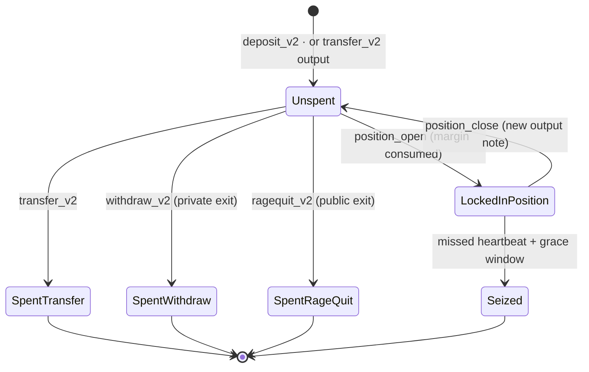

`withdraw_v2` and `ragequit_v2` share a nullifier by design, a note exits privately **or** publicly, never both.

---

## 6. Accumulator design

### 6.1 Commitment tree

```
TREE_DEPTH        = 20        →  1,048,576 leaves per pool
ROOT_HISTORY_SIZE = 32        →  32-root ring buffer
Hash              = Poseidon2
Insertion         = frontier (filledSubtrees), O(depth) hashes, O(1) new storage
```

Insertion touches only a **frontier array** (one sub-root per level) rather than materializing siblings. Cost per deposit is flat regardless of occupancy, with no per-leaf persistent ledger entry.

```
Inserting leaf 5 into a depth-20 tree — only the bold path is touched.

  level 20            ██ root                    frontier[]
                     /        \                  ─────────────
  level 19       ██ ●          ○                 [0] = h(L4,L5)
                /     \       /  \               [1] = h(h(L0,L1),h(L2,L3))
  level 18    ○         ██ ●     ○   ○           [2] = …
             / \       /   \                     …
  leaves   L0 L1 L2 L3 L4  ██L5   (empty…)       [19] = ─

  20 Poseidon2 hashes · 1 storage write · O(1) new entries
  Cost is identical at leaf 5 and at leaf 1,000,000.
```

The 32-root history makes the pool usable under concurrency: a proof generated against root *R* stays valid after other deposits land. SDF's prototype lists this as outstanding work; it has been live in Vayyl since first deployment.

### 6.2 Nullifier set: current design and its known limit

Nullifiers are flat persistent storage entries; presence means spent. Simple, correct, and cheap, with two limits we have identified and scoped:

1. **Archival.** Persistent entries archive at TTL. A spent nullifier observed as absent would permit a double-spend (§18.3).
2. **Non-membership is by storage lookup, not by proof.** Fine for our own pool. Insufficient for an external contract that wants to *prove* a nullifier is unspent without trusting us.

Aztec solves both with an **[indexed Merkle tree](https://docs.aztec.network/developers/docs/foundational-topics/advanced/storage/indexed_merkle_tree)**, a sparse structure where each leaf stores its value plus a pointer to the next-highest value, making non-membership a cheap in-circuit proof. Namada uses a nullifier tree alongside its commitment tree for the same reason.

Adopting it fixes both problems at once, because the tree's **root lives in instance storage and therefore cannot archive.** This is our highest-priority accumulator upgrade (§21.2).

---

## 7. Contracts

Rust, `#![no_std]`, one crate per contract, `wasm32v1-none`. Release profile: `opt-level = "z"`, LTO, `panic = "abort"`, `overflow-checks = true`.

| Contract | Role | State |
|---|---|---|
| **`groth16-verifier`** | `CircuitId → VerificationKey` registry; calls native `bn254_*`. One verification path for the whole protocol. | ✅ Mainnet |
| **`vayyl-pool`** | Per-asset shielded pool: Merkle frontier, root history, nullifier set, deposit / transfer / withdraw / rage-quit, SAC transfers. | ✅ Mainnet |
| **`vayyl-pool-factory`** | Deploys one `VayylPool` per asset. | 🔨 Built |
| **`asp-membership`** | Approved-set Merkle root; membership proved in ZK. | ✅ Mainnet |
| **`asp-non-membership`** | Restricted-set exclusion. | 🔨 Deployed; indexed-tree upgrade §21.2 |
| **`position-manager`** | Open / attest-health / close private positions. | 🔨 Built |
| **`liquidation-engine`** | Heartbeat registry, grace window, keeper `reveal_and_seize`. | 🔨 Built |
| **`hidden-order-registry`** | Sealed order commitments; trigger-proof execution. | 🔨 Built |
| **`agentic-settlement-hub`** | Authorized agent settlement and reward claims. | 🔨 Built |
| **`vayyl-counterparty-vault`** | Reserving vault backing position payouts. | 📐 Specified §11.6 |
| **`vayyl-types`** | Shared `CircuitId`, `VerificationKey`, `Groth16Proof`, `PositionState`. | ✅ |

Every deployed contract carries `upgrade()`, the single most valuable safety valve on a protocol holding funds, and the reason forward fixes need neither redeployment nor note migration.

### 7.1 One pool per asset: and the tension we acknowledge

`VayylPoolFactory` deploys a **dedicated pool per asset**. A shared multi-asset pool collapses all commitments and nullifiers into one storage namespace, a correctness hazard and a cross-asset collision concern.

**Namada takes the opposite view,** and it is a serious one. Its [MASP](https://github.com/namada-net/masp) provides *"a unified privacy set for all assets"*, every asset shares one anonymity set instead of fragmenting into per-asset crowds. At low volume, fragmentation is the dominant privacy cost, and MASP is strictly better on that axis.

We chose per-asset pools for storage isolation and independently measurable anonymity sets. **We treat MASP as an open architectural question, not a settled one**, see §21.5 for the evaluation criteria and the migration path if the answer changes.

### 7.2 The verifier, and the check that is not optional

`Groth16Verifier` **rejects any verification key where `gamma == delta`** (`Error::GammaEqualsDelta`).

Not theoretical hardening, this is the exact flaw that drained Veil Cash and FoomCash. With `gamma == delta`, an attacker constructs a proof that verifies for arbitrary public inputs. The check is admin-gated, unit-tested, and re-enforced in the deploy script before any key registers.

The verifier returns `Ok(false)` on a failed pairing rather than trapping, a failed proof is an outcome, not a panic. Note too that CAP-0074 mandates on-curve **and** correct-subgroup validation for G2 inputs to `bn254_multi_pairing_check`: the small-subgroup forgery vector is closed **by the host**, and the contract correctly does not re-implement it.

### 7.3 CircuitId ordinals are the on-chain ABI

Declaration order **is** the numeric circuit ID used when registering keys. Inserting a variant silently repoints every later key.

| # | Variant | # | Variant |
|---|---|---|---|
| 0 | `Deposit` | 7 | `HiddenOrderTrigger` |
| 1 | `Transfer` | 8 | `MultiLegBasket` |
| 2 | `Withdraw` | 9 | `AspMembership` |
| 3 | `PositionOpen` | 10 | `AspNonMembership` |
| 4 | `PositionHealth` | 11 | `SealedOrder` |
| 5 | `PositionClose` | 12 | `RageQuit` |
| 6 | `LiquidationHeartbeat` | | |

**Append only**, documented in the source above the last variant, so the constraint travels with the code.

---

## 8. Circuits

Public inputs are the contract's entire view of a proof. Everything else is witness.

| Circuit | Public inputs | # |
|---|---|---|
| `deposit_v2` | `commitment`, `asp_root` | 2 |
| `withdraw_v2` | `root`, `nullifier`, `withdraw_binding` | 3 |
| `transfer_v2` | `root`, `nullifier`, `commitment`, `ephemeral_x`, `ephemeral_y` | 5 |
| `ragequit_v2` | `commitment`, `nullifier`, `exit_binding` | 3 |
| `asp_membership` | `root` | 1 |
| `position_open` | `root`, `nullifier`, `position_commitment`, `meta_hash` | 4 → 7 (§11.4) |
| `position_health` | `position_commitment`, `oracle_price`, `oracle_timestamp`, `health_threshold` | 4 |
| `position_close` | `position_nullifier`, `new_position_commitment`, `output_note_commitment`, `oracle_price`, `fee`, `meta_hash` | 6 |
| `liquidation_heartbeat` | `position_commitment`, `keeper_public_commitment`, `timestamp` | 3 |
| `hidden_order_trigger` | `order_commitment`, `oracle_price`, `meta_hash` | 3 |
| `sealed_order` | `order_commitment` | 1 |

Public-input count is a direct cost driver. CAP-0074 provides no MSM primitive, so the verifier accumulates with one `bn254_g1_mul` + one `bn254_g1_add` **per public input**, **cost linear in public inputs**. This makes trimming them a real optimization lever, and is precisely why `transfer_v2` is 1-in/1-out (§9.2).

### 8.1 Circuit discipline: non-negotiable

1. **Use `<==` and `===`, never `=`.** A bare assignment computes without constraining. The original Tornado Cash bug was exactly this.
2. **Range-check every signal before it enters a multiplication**, sized to real maximum width, not a circomlib default. Unconstrained multiplication is field-overflow wraparound waiting to happen.
3. **Pin boolean selectors via a range check on the *selected value*,** not merely `D*(D-1) === 0`. Reference pattern: `position_health.circom`, five magnitudes range-checked before multiplication, selector pinned by a 65-bit range check on the *selected delta*, comparator explicitly sized to 210 bits.
4. **Bind `fee`, `relayer`, `recipient`** (or the position/order equivalent) into every circuit with external consequences (§9.3).
5. **Every free `signal input` not derived or constrained is attacker-chosen.** Treat it that way.

---

## 9. Private payments: the live vertical ✅

### 9.1 Shield (`deposit_v2`)

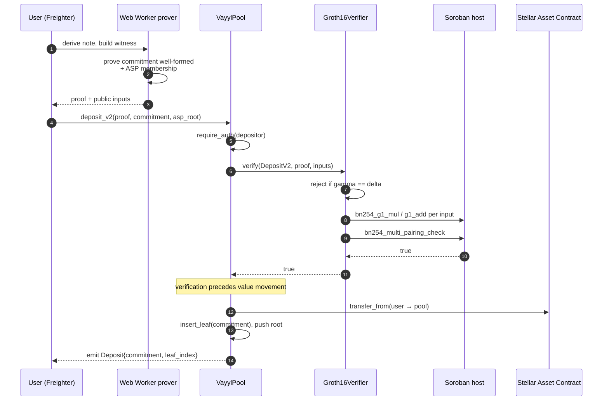

The proof establishes that the commitment is a well-formed note of the pool's denomination **and** that the depositor's key is in the ASP approved set, without revealing which member. Verification precedes the transfer.

The depositor's Stellar address is necessarily public: real funds enter a public ledger and `depositor.require_auth()` is required. Inherent, not a gap (§20).

### 9.2 Private transfer (`transfer_v2`): the actual product

Deposit and withdraw alone make a *mixer*. Transfer is what makes a **payments system**: value enters once, moves privately many times, exits rarely.

**1-in / 1-out, not 2-in / 2-out.** At fixed denomination the balance equation is degenerate, both amounts are circuit constants. Removing it structurally eliminates a class of value-conservation bugs, needs no change note, and **halves the proving key** (9.4 MB vs 18 MB), decisive for mobile.

**Recipient discovery: ephemeral-key ECDH, no ciphertext published.**

```
Sender:     r ← random scalar
            R = r · Base8                     published as (ephemeral_x, ephemeral_y)
            S = r · PK_recipient
            blindness  = Poseidon2(S.x, 0)
            commitment = Poseidon2(pubX_recip, pubY_recip, amount, blindness)

Recipient:  S' = spendKey · R                 equals S by ECDH
            blindness = Poseidon2(S'.x, 0)
            → recomputes the commitment, recognizes the note
```

```mermaid
sequenceDiagram
  autonumber
  participant S as Sender
  participant P as VayylPool
  participant IX as Indexer
  participant R as Recipient

  S->>S: r ← random; R_pt = r · Base8
  S->>S: shared = r · PK_recipient
  S->>S: blindness = Poseidon2(shared.x, 0)
  S->>S: commitment = Poseidon2(pubX_r, pubY_r, amount, blindness)
  Note over S: prove: own input note · Merkle inclusion<br/>nullifier fresh · output well-formed
  S->>P: transfer_v2(proof, root, nullifier,<br/>commitment, ephemeral_x, ephemeral_y)
  P->>P: verify · mark nullifier · insert leaf
  P-->>IX: emit TransferV2{commitment, R_pt}
  IX-->>R: event stream
  R->>R: shared' = spendKey · R_pt  (= shared, by ECDH)
  R->>R: blindness = Poseidon2(shared'.x, 0)
  R->>R: recompute commitment → match → note is mine
  Note over S,R: no ciphertext ever published<br/>sender and recipient never interact directly
```

Nothing encrypted is posted on-chain. Two properties are load-bearing:

- **`ephemeral_x` / `ephemeral_y` MUST be public inputs.** A relayer able to substitute `R` would leave the recipient permanently unable to derive the blindness, note destroyed forever, for one transaction fee. Binding `R` into the proof makes tampering fail verification.
- **Subgroup membership is enforced on every point.** A sender setting `R` to an order-8 point collapses the shared secret to 8 candidates keyed by `spendKey mod 8`; publishing one and observing whether the wallet spends it leaks 3 bits of the recipient's spend key per attempt. `assertUsablePoint` in `lib/transfer.ts` and `decodeShieldedAddress` both enforce prime-order membership. Never removed.

The circuit deliberately does **not** prove the ECDH relation, that needs an in-circuit variable-base scalar multiplication for no soundness gain, since a sender who lies only burns their own funds.

Shielded addresses are `VAYYL…`-prefixed with a CRC16 checksum, encoding the recipient's BabyJubjub public key.

### 9.3 Unshield (`withdraw_v2`) and front-running defense

A Groth16 proof is a public artifact. If the recipient is not bound into it, a watcher lifts it from the mempool, substitutes their address, and steals the withdrawal.

`withdraw_v2` binds `recipient`, `relayer`, and `fee` into a `withdraw_binding` public input. Altering any invalidates the proof; copying it is worthless. SDF's prototype lists this as *"not yet implemented in main.circom."* Ours is covered by an explicit `changed_recipient_rejected` test.

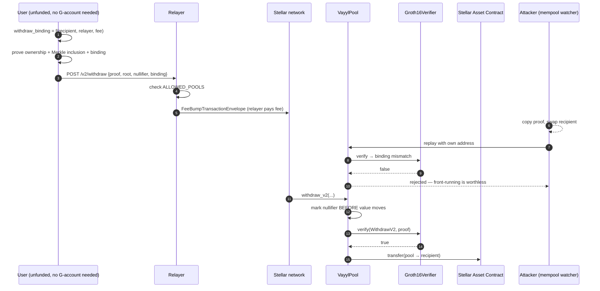

`withdraw_v2` carries **no** `require_auth`, which permits relayed submission, the user needs no funded Stellar account and the withdrawal is not linkable through the fee payer.

### 9.4 Rage-quit: the compliance escape hatch

If an ASP delists a depositor *after* deposit, a naive design strands their funds permanently. `ragequit_v2` provides a **public exit**: prove ownership of a specific commitment, receive funds, forfeit privacy, recover value.

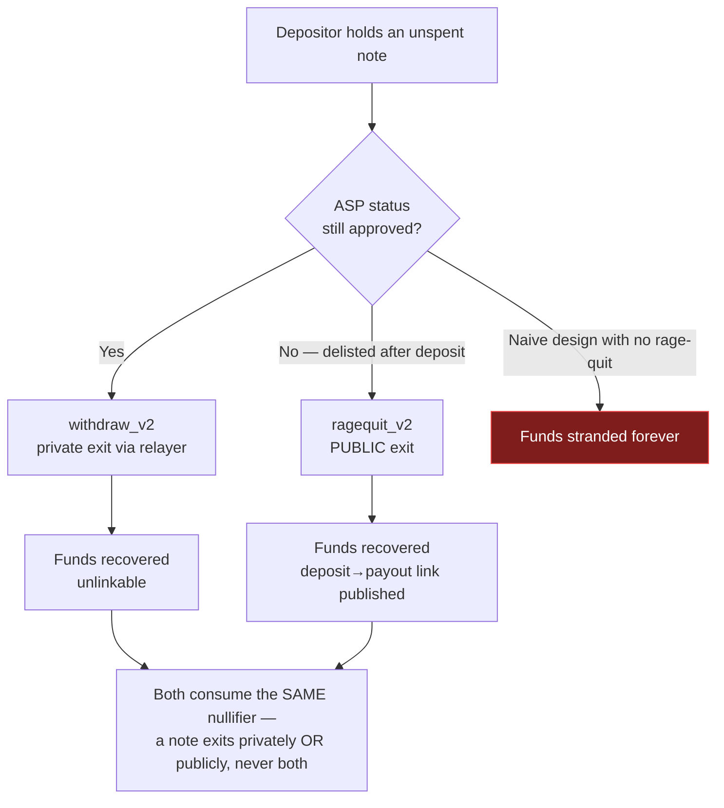

- **No Merkle path**, the commitment is a public input, so inclusion is a direct key lookup. 6,313 constraints, three public inputs.
- **Shares `withdraw_v2`'s nullifier**, a note exits privately or publicly, never both. Tested in both orders.
- **Deliberately not blocklist-gated.** A blocklist denies an *anonymous* exit, not access to one's own funds. Rage-quit publishes the deposit→payout link, which is exactly what a compliance process wants.

🔨 Built and tested (7 pool tests, 9 circuit cases). Deployment sequenced with the next `upgrade()` and VK registration at ordinal 12.

---

## 10. Compliance layer

Privacy that regulated businesses cannot legally touch is a research project, not a product. Compliance is in Vayyl from the first commit.

Stellar's documentation describes the intended shape:

> *"Association Set Providers (ASPs) can manage allow/deny lists that ensure known bad actors cannot interact within the pool… Some systems also include view keys that allow authorized parties to investigate suspicious transactions or respond to law enforcement requests, without sacrificing the privacy of other legitimate pool participants."*

Vayyl implements all four mechanisms named there:

| Mechanism | How | State |
|---|---|---|
| **Membership (allow-list)** | `ASP_leaf = Poseidon2(pubX, pubY)` in a Merkle tree; proved in-circuit at deposit | ✅ Live |
| **Non-membership (deny-list)** | Nullifier checked against a restricted set before payout; indexed-tree upgrade §21.2 | 🔨 Deployed |
| **Selective disclosure (view keys)** | Per-transaction disclosure proof; hierarchical key upgrade §21.3 | 📐 Specified |
| **Rage-quit** | Guaranteed public exit for a delisted depositor (§9.4) | 🔨 Built |

The ASP root lives on-chain in `asp-membership`. Enrollment runs through the relayer's `/v2/enroll` endpoint with a chain-consistency check (`verifyAgainstChain()`) that loudly disables enrollment on drift between mirror and on-chain root, rather than silently issuing leaves that can never prove membership.

---

## 11. Private positions 🔨

*Implemented in-repository; the tiered-vault redesign is 📐 specified and sequenced. This section includes the two designs we rejected, because the rejection is the interesting part.*

### 11.1 Why positions, not just payments

Payment privacy hides a *transaction*. Position privacy hides a *decision*, the output of research, timing, and conviction someone built. Protecting that asymmetry is a stronger and more durable reason for this protocol to exist than payment privacy alone.

It is also the layer no other Stellar privacy effort is building.

### 11.2 The counterparty problem

A derivative needs someone to pay the winner. Four arrangements exist. Getting this wrong is not an audit finding, it is a protocol that mints money.

| Option | Mechanism | Solvency | Verdict |
|---|---|---|---|
| Mint PnL into the pool | Profit created from nothing | **Insolvent by construction** | Rejected |
| Pool as uncapped counterparty | Pool pays winners from deposits | Insolvent whenever traders net-win | Rejected |
| Peer-to-peer matched book | Long matched against short | Sound | Needs private matching (MPC/FHE), 🔬 |
| **Funded vault, capped payout** | LPs fund a vault; max payout *reserved* at open | **Sound as an accounting identity** | ✅ **Adopted** |

```
vault_balance  ≥  Σ over open positions of ( max_payout(tier) − margin(tier) )
```

`reserve()` failing when the vault is short **is** the safety property: a position cannot open unless the money to pay its best case already exists. Solvency stops being a risk model and becomes an on-chain check.

### 11.3 Tiered positions

| Tier | Notional | Margin | Max payout | Vault reserves |
|---|---|---|---|---|
| T1 | 100 XLM | 10 XLM | 30 XLM | 20 XLM |
| T2 | 1,000 XLM | 100 XLM | 300 XLM | 200 XLM |

Same trick as fixed denominations on the payments side: **bucket the public dimension so the private dimension has a crowd to hide in.**

| | Public | Private |
|---|---|---|
| Open | tier, entry price (= oracle), oracle timestamp, position commitment | **owner**, **direction**, blinding, link to collateral note |
| Health | position commitment, oracle price/timestamp, health threshold | direction, entry price, solvency margin |
| Close | position nullifier, output note commitment, oracle price, fee | direction, realized PnL, owner, link to open |

An observer sees *"a T2 position opened at price P"* and later *"a T2 position closed."* They cannot determine which close matches which open, which direction either was, or who owned them.

That is the correct trade. Knowing *somebody* opened a 1,000-XLM position at the current oracle price is worth nearly nothing. Knowing **who** and **which way** is the entire alpha, exactly the two dimensions this keeps secret.

### 11.4 Circuit changes

`position_open` gains three public inputs (`tier_id`, `oracle_price`, `oracle_timestamp`) and loses four private ones:

```circom
component note = Note();                    // pubX/pubY DERIVED from privKey
note.privKey   <== privKey;
note.amount    <== TIER_MARGIN[tier_id];    // public tier constant
note.nullifier === nullifier;
MerkleProof(note.commitment, path) === root;

entry_price <== oracle_price;               // entry price IS the oracle price
size * entry_price === TIER_NOTIONAL[tier_id];

direction * (direction - 1) === 0;
RangeCheck64(size); RangeCheck64(entry_price);

PositionCommitment(margin, size, direction, entry_price,
                   note.pubX, note.pubY, position_blindness) === position_commitment;
```

Two constraints carry the design. `Note()` instead of free `pubX`/`pubY` prevents nullifier grinding. `entry_price <== oracle_price` makes opening at a self-chosen entry price structurally impossible.

`position_close` derives the old key from `old_privKey` and adds the solvency cap:

```circom
note_amount + fee <= TIER_MAX_PAYOUT[tier_id];   // AssertLessEqThan, explicitly sized
```

`position_health` gains `privKey` so an attestation proves **ownership**, not merely knowledge of contents.

### 11.5 Position lifecycle, end to end

```mermaid
sequenceDiagram
  autonumber
  participant T as Trader
  participant PM as PositionManager
  participant VA as CounterpartyVault
  participant O as Reflector SEP-40
  participant V as Groth16Verifier
  participant P as VayylPool
  participant K as Keeper

  rect rgb(30,58,95)
  Note over T,P: OPEN
  T->>PM: open_position(tier, proof)
  PM->>O: lastprice(asset)
  PM->>PM: reject if price stale
  PM->>VA: reserve(position_id, tier)
  VA-->>PM: ERROR if free_balance < max_payout − margin
  PM->>V: verify(PositionOpen) — entry_price === oracle_price
  PM->>P: consume margin note (nullifier)
  PM->>PM: store PositionState{tier, entry_price, commitment}
  end

  rect rgb(30,64,48)
  Note over T,K: HEALTH — the heartbeat
  loop every interval
    T->>PM: attest_health(proof, oracle_price)
    PM->>PM: last_health = env.ledger().timestamp()
  end
  end

  alt Trader closes
    T->>PM: close_or_modify_position(proof)
    PM->>V: verify(PositionClose) — payout ≤ TIER_MAX_PAYOUT
    PM->>VA: release(position_id, actual_payout)
    PM->>P: execute_settlement → output note
    PM->>PM: remove record when size == 0
  else Heartbeat lapses
    K->>PM: grace window elapsed
    K->>PM: reveal_and_seize
    PM->>PM: seize_amount := TIER_MARGIN (never caller-supplied)
    PM->>VA: release(position_id, 0)
  end
```

**Direction never leaves the client** at any point in this diagram. The keeper learns that *a* position went stale, not which way it was pointing.

### 11.6 `VayylCounterpartyVault` 📐

```rust
initialize(admin, asset, pool, position_manager)
deposit_liquidity(lp: Address, amount: i128)
withdraw_liquidity(lp: Address, amount: i128)   // only against unreserved balance

// PositionManager only — allowlisted, require_auth:
reserve(position_id, tier_id) -> Result<(), Error>   // errors if free_balance < reserve
release(position_id, actual_payout: i128)

free_balance() -> i128        // balance − total_reserved
total_reserved() -> i128
```

### 11.7 Oracle integration

Prices from **Reflector Network**, Stellar's [SEP-40-compatible oracle](https://developers.stellar.org/docs/data/oracles/oracle-providers#reflector-network), via the real `lastprice(asset)` interface.

Three independent defenses; staleness alone is **not** sufficient:

1. **Circuit binding**, `oracle_price` and `oracle_timestamp` are public inputs, so a proof is cryptographically bound to the price it was made against.
2. **Contract-side staleness**, `PositionManager` rejects `open_position` and `attest_health` on a stale price, on-chain, not in the adapter.
3. **Liquid-assets-only policy**, an illiquid asset's price is manipulable regardless of freshness.

Heartbeats use `env.ledger().timestamp()`, never the oracle's. A frozen oracle must not freeze every position's liveness clock.

### 11.8 Liquidation

The design's most elegant property, and it survives intact: **the inability to produce a health proof is itself the liquidation signal.**

A holder periodically proves solvency at a public `health_threshold` against the current price, revealing nothing. If the heartbeat lapses past its grace window, a keeper may `reveal_and_seize`. `seize_amount` is bound to `TIER_MARGIN` from stored `PositionState`, never caller-supplied.

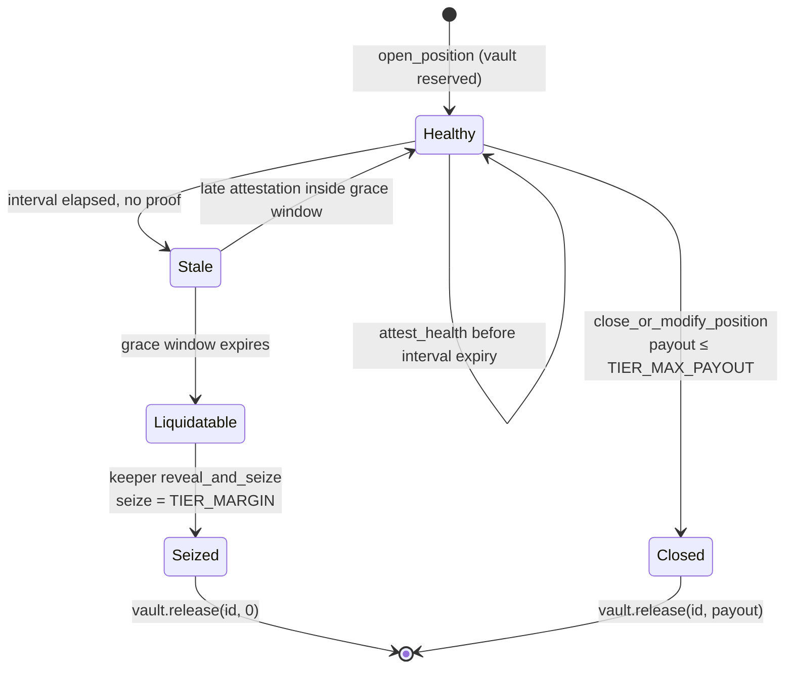

Note what the public state machine leaks and what it does not: an observer sees a position transition to `Stale`. They do not learn its direction, its entry price, its owner, or whether it was actually underwater, only that a proof was not produced.

### 11.9 What is honestly still open

- **The vault is delta-exposed, not delta-neutral.** Direction is private, so it cannot compute net open interest or hedge. It is *capped*, which is what makes it safe.
- **No funding rate**, a funding rate requires the long/short imbalance, which is precisely what is hidden.
- **No price-impact modelling.** Tier notionals are fixed and small.
- **On testnet the vault is faucet-funded.** Proofs, collateral, liquidation, and settlement are real; the counterparty is synthetic. We label this in-product.

Real delta-neutrality requires either revealing net open interest or private matching, a named research track (§22.4), not a gap we are papering over.

---

## 12. Hidden Conditional Orders 🔨

A resting order on any public book is a free option granted to every observer. Stop-losses get hunted; take-profits get front-run. The information leak *is* the attack.

**`sealed_order`**, commits an order without revealing it. One public input: `order_commitment = Poseidon2(side, trigger_price, size, owner_pubkey, blindness)`. The order rests on-chain as an opaque field element.

**`hidden_order_trigger`**, proves in zero knowledge that a committed order's trigger condition holds at the current oracle price, and authorizes execution. Public inputs: `order_commitment`, `oracle_price`, `meta_hash`. **The trigger price never appears on-chain, not at rest, not at execution.**

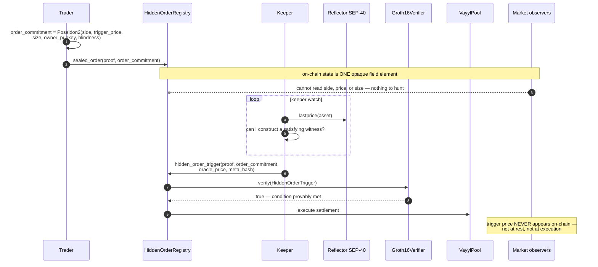

`HiddenOrderRegistry` stores commitments; the keeper watches oracle movement and submits trigger proofs. Batch sealed-bid uniform-price clearing is the natural extension (§22.4).

---

## 13. Confidential Agentic Settlement 📐

Stellar has shipped two agent-payment protocols, both live:

- **[x402 on Stellar](https://developers.stellar.org/docs/build/agentic-payments/x402)**, Coinbase Developer Platform's open protocol for per-request HTTP payments, settling via **Soroban authorization entries** with facilitator-based verification. The [Built on Stellar Facilitator](https://developers.stellar.org/docs/build/agentic-payments/x402/built-on-stellar) (OpenZeppelin Relayer plus the x402 Facilitator Plugin) exposes standard **`/verify`, `/settle`, `/supported`** endpoints and accepts any SEP-41 asset, defaulting to USDC.
- **[MPP on Stellar](https://developers.stellar.org/docs/build/agentic-payments/mpp)**, the Machine Payments Protocol, settling directly through SAC transfers with no external facilitator.

**Every agent micropayment on both rails settles in full public view.** Which agent called which API, how often, for how much, a permanent competitive-intelligence feed on any agentic business built on Stellar.

Vayyl's integration is deliberately conservative in shape: **an x402-compatible facilitator exposing the same `/verify` / `/settle` / `/supported` interface**, settling through the shielded pool instead of a transparent SAC transfer. An agent that already speaks x402 gains confidentiality by changing a facilitator URL, no protocol fork, no client rewrite.

```mermaid
sequenceDiagram
  autonumber
  participant A as AI Agent
  participant API as Paid API (seller)
  participant F as Vayyl x402 Facilitator
  participant P as VayylPool
  participant OBS as Competitor watching the chain

  A->>API: GET /resource
  API-->>A: 402 Payment Required<br/>{price, asset, facilitator: vayyl}
  A->>A: build Soroban auth entry + shielded proof
  A->>F: POST /verify
  F->>F: validate proof, ASP status, replay guard
  F-->>A: 200 verified
  A->>API: retry with X-PAYMENT header
  API->>F: POST /settle
  F->>P: shielded settlement (transfer_v2)
  P-->>F: settled
  F-->>API: settlement receipt
  API-->>A: 200 + resource

  rect rgb(90,30,30)
  Note over OBS: TODAY on x402/MPP — sees agent identity,<br/>which API, call frequency, and amount
  end
  rect rgb(25,70,45)
  Note over OBS: WITH Vayyl — sees only that<br/>a shielded settlement occurred
  end
```

The interface is deliberately identical to the [Built on Stellar Facilitator](https://developers.stellar.org/docs/build/agentic-payments/x402/built-on-stellar): `/verify`, `/settle`, `/supported`. **An agent gains confidentiality by changing one URL.**

**Tael Protocol** (a live-on-mainnet x402 agent-payment layer on Stellar) already lists Vayyl publicly as a privacy layer for Stellar transactions. Planned capability surface:

| Capability | Function | Dependency |
|---|---|---|
| `vayyl.commitment_set` | Read the current commitment set | Read-only |
| `vayyl.merkle_path` | Merkle path for a commitment | Read-only |
| `vayyl.asp_check` | ASP membership status | Read-only |
| `vayyl.pool_stats` | Live anonymity-set size | Read-only |
| `vayyl.relay` | Submit a shielded transaction | Relayer set |
| `vayyl.shielded_payout` | Confidential agent settlement | USDC pools |
| `vayyl.attest_solvency` | Prove agent solvency without revealing balances | Positions layer |

One constraint we state rather than hide: **a hosted prover sees the witness.** Any `vayyl.prove` capability is labelled "trusted-prover mode" or is not shipped. Privacy claims that quietly depend on trusting our server are not privacy claims.

---

## 14. The Vayyl SDK 📐

*Rough shape. This is the deliverable that converts Vayyl from an application into infrastructure, and it is scoped accordingly.*

### 14.1 Why it exists

Today, integrating confidential settlement means understanding Circom, Groth16 serialization, BabyJubjub key derivation, Merkle path reconstruction, and Soroban XDR. That is a specialist skill set, and requiring it caps adoption at zero.

The SDK's job is that **an integrator writes application code and never touches a circuit.**

### 14.2 Package layout

| Package | Contents |
|---|---|
| `@vayyl/sdk` | High-level client, the surface 95% of integrators use |
| `@vayyl/core` | Note model, commitments, nullifiers, BabyJubjub, shielded-address codec |
| `@vayyl/prover` | Proving backends, Web Worker (browser), native (`rapidsnark`), hosted (opt-in) |
| `@vayyl/circuits` | Versioned circuit artifacts, `.wasm` + `.zkey`, content-addressed and integrity-checked |
| `@vayyl/contracts` | Typed Soroban bindings, generated from contract specs |
| `@vayyl/relayer-client` | Relayer selection, submission, retry, multi-relayer randomization |
| `vayyl-verify` *(Rust crate)* | Contract-side helper for consuming Vayyl proofs from another Soroban contract |

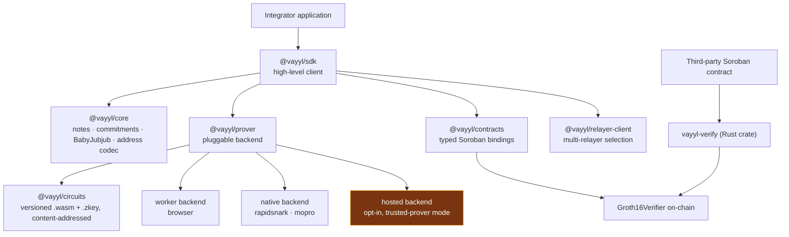

### 14.3 Client surface

```ts
import { VayylClient, CircuitId } from '@vayyl/sdk';

const vayyl = await VayylClient.init({
  network: 'testnet',
  wallet:  freighterAdapter,
  prover:  { backend: 'worker' },     // 'worker' | 'native' | 'hosted'
});

// Deterministic shielded identity, derived from a wallet signature.
const identity = await vayyl.identity.derive();
identity.shieldedAddress;             // "VAYYL1q9x…" (BabyJubjub pubkey + CRC16)

// Note management — sync, balance, scan.
await vayyl.notes.sync();                       // §15 discovery
const balance = await vayyl.notes.balance('XLM');

// Payments
await vayyl.shield({ asset: 'XLM', amount: 10n });
await vayyl.transfer({ to: 'VAYYL1q9x…', asset: 'XLM', amount: 3n });
await vayyl.unshield({ to: 'GABC…', asset: 'XLM', amount: 5n, viaRelayer: true });

// Compliance
const disclosure = await vayyl.disclose({ txId, audience: auditorPubkey });

// Positions
const pos = await vayyl.positions.open({ tier: 'T2', direction: 'long' });
await vayyl.positions.attestHealth(pos.id);
await vayyl.positions.close(pos.id);

// Raw proving, for anything we have not wrapped yet.
const { proof, publicInputs } = await vayyl.prove(CircuitId.PositionHealth, witness);
```

### 14.4 Contract-side consumption

The composable verifier is the point. Any Soroban contract consumes a Vayyl proof with one cross-contract call:

```rust
use vayyl_verify::{VayylVerifier, CircuitId};

let verifier = VayylVerifier::new(&env, &VAYYL_VERIFIER_ID);
let ok: bool = verifier.verify(&CircuitId::PositionHealth, &proof, &public_inputs);
```

A lending protocol can demand *"prove this position is solvent"* before extending credit, and learn size, direction, and entry price never. It writes no circuits, runs no prover, builds no ZK infrastructure.

### 14.5 Contracts the SDK enforces on its users

An SDK that lets integrators build something insecure has failed. Three obligations are enforced in types and documented at every call site:

1. **Verifying the proof is not verifying the statement.** A valid proof shows only that *some* witness satisfies the circuit. The consuming contract must validate public-input semantics, which root, which action, which amount, which nullifier. `vayyl-verify` returns a typed `VerifiedStatement`, not a bare `bool`, forcing the caller to name what they believe they verified.
2. **Anti-replay is mandatory.** Valid proofs can be replayed. Every externally-consequential circuit binds a nullifier or nonce, and `vayyl-verify` exposes a replay-guard helper rather than leaving it to the integrator.
3. **Circuit artifacts are version-pinned and integrity-checked.** A `.zkey` mismatched to its registered VK produces proofs that never verify, silently. `@vayyl/circuits` content-addresses every artifact and asserts the hash against the on-chain registration before proving.

### 14.6 Distribution

Published to npm and crates.io, versioned against the on-chain `CircuitId` registry, with a reference integration and a quickstart that takes a developer from zero to a verified shielded transfer in under fifteen minutes.

---

## 15. Note discovery: the scaling problem nobody advertises

This deserves its own section because it is the single most under-discussed failure mode in shielded-pool design, and we would rather name it than be asked about it.

**The problem.** A recipient does not know which on-chain commitment belongs to them. They must test each one. Today, Vayyl's client scans `TransferV2` events and recomputes candidate commitments locally, correct, private, and **linear in total protocol volume**.

That is fine at current volume and untenable at scale. Zcash has lived this: full-scan note discovery *"can take hours even for a relatively lightly-used chain, and is recognized as a severe usability and scalability issue."*

**How the field solves it, three approaches, ranked by production readiness:**

| Approach | How | Status elsewhere |
|---|---|---|
| **[Fuzzy Message Detection](https://protocol.penumbra.zone/main/crypto/fmd.html)** | A detection key flags all of your notes plus a *tunable* share of decoys. You trial-decrypt a small blurred set. Detection capability is strictly weaker than viewing capability, a detector learns probabilistic association, never contents. | **Penumbra runs it in production** |
| **[Oblivious Message Retrieval](https://eprint.iacr.org/2021/1256.pdf)** | A server returns your messages without learning which are yours. Stronger privacy, heavier cryptography. | Zcash research; [PerfOMR](https://www.usenix.org/system/files/usenixsecurity24-liu-zeyu.pdf) improves cost |
| **Zcash Tachyon** | Removes in-band secret distribution entirely, moving note delivery off-chain and stripping key diversification, viewing keys, and payment addresses out of the circuits | NU7 testnet |

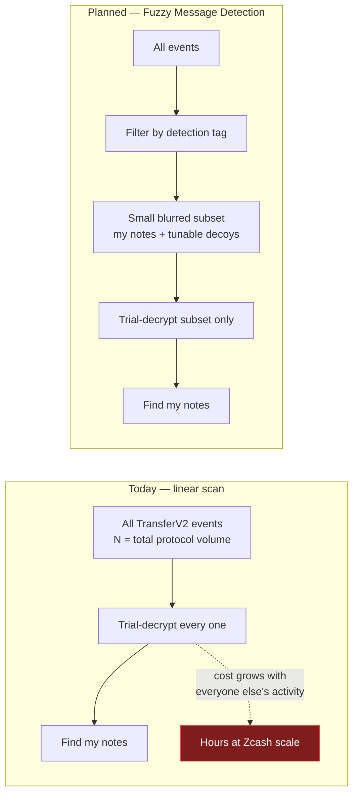

The decoy rate is the privacy dial: a larger false-positive share costs more trial decryption and reveals less to the detector. Crucially, **detection capability is strictly weaker than viewing capability**, a detector learns probabilistic association, never contents.

**Our position:** FMD is the right target, production-proven, tunable, and it composes with our existing ECDH scheme rather than replacing it. The detection key becomes a third key alongside spend and view, which fits naturally into the hierarchical key work in §21.3. This is scoped in §21.1 and it is the correct thing to build **before** volume makes it urgent, not after.

---

## 16. Off-chain services

| Service | Language | Role | Why it must exist |
|---|---|---|---|
| **Indexer** | TypeScript | Polls Stellar RPC for commitment/nullifier events → Postgres | **Stellar RPC retains events for 7 days.** Shielded notes sit untouched for months. Without durable indexing, clients cannot rebuild Merkle paths and **notes become unspendable.** A correctness dependency, not analytics. |
| **Relayer** | TypeScript | Wraps a signed proof in a `FeeBumpTransactionEnvelope` and submits | Lets a user withdraw without a funded Stellar account; breaks fee-payer linkage. **Stateless with respect to funds**, pays fees, never holds note secrets or custody. |
| **Oracle adapter** | TypeScript | Validates SEP-40 (Reflector) prices with staleness enforcement | One of three price defenses (§11.7) |
| **Keeper** | TypeScript | Heartbeat monitoring, liquidation triggers, hidden-order execution | Positions and orders liveness |
| **Proof bridge** | Rust | snarkjs JSON (`A∈G1, B∈G2, C∈G1`) → the raw binary layout Soroban's pairing functions expect | Serialization mismatch here fails *silently*, proof valid, never verifies |

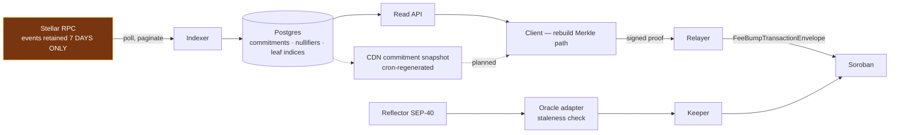

**Shielded notes sit untouched for months; RPC forgets in seven days.** That gap is why the indexer is a correctness dependency, and why the CDN snapshot path exists, it removes our infrastructure from the note-recovery critical path entirely.

**Note recovery must not depend on our uptime.** The roadmap removes the indexer from the critical path via a **static commitment snapshot published to CDN**, regenerated by cron, converting a liveness dependency into a static file. More decentralized, and a stronger guarantee to users.

---

## 17. Client and proving performance

The DApp is React + Zustand + Freighter, and **proof generation runs in a Web Worker, never the main thread**. Not a preference: iOS Safari terminates workers exceeding roughly 1–2 GB, and a circuit that proves comfortably on desktop can fail outright on mobile. Off-thread proving is what makes profiling and graceful degradation possible at all.

Notes live in IndexedDB with encrypted, wallet-bound backup and import. Proving keys lazy-load per flow, a user making a deposit never downloads the position-close key.

### 17.1 The proving pipeline

Every stage must agree. A mismatch at any one of them produces a proof that is internally valid and never verifies on-chain, **silent failure, not an error**.

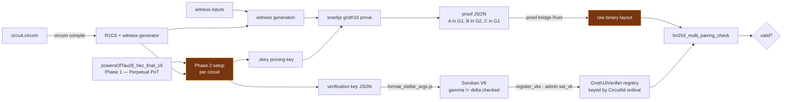

The two amber stages are where silent failure lives: a regenerated `.zkey` whose VK was never re-registered, and a serialization mismatch in the proof bridge. `@vayyl/circuits` content-addresses artifacts and asserts their hash against the on-chain registration precisely to close the first (§14.5).

### 17.2 Client proving performance

**Where we currently leave performance on the table**, with concrete numbers from the field:

| Lever | Gain | Source |
|---|---|---|
| `rapidsnark` (C++/asm) instead of snarkjs | **4–10× faster** Groth16 proving | [Mopro prover comparison](https://zkmopro.org/blog/circom-comparison/) |
| Native witness generation instead of WASM | **~11 s → ~1 s** | Mopro benchmarks |
| [Mopro](https://zkmopro.org/) toolkit | iOS/Android/React Native bindings from the same circuits | zkmopro |
| WASM + Rayon multithreading | Parallel proving in-browser | Mopro |
| WebGPU / [ICICLE-Snark](https://github.com/ingonyama-zk/icicle-snark) | GPU-accelerated Groth16 | Ingonyama |

Adopting `rapidsnark` and native witness generation via Mopro is the single highest-leverage client change available, and it is what makes a genuine mobile product possible rather than aspirational (§21.6).

---

## 18. Cost, limits, and state archival

### 18.1 Measured on mainnet

Not simulated. Paid.

| Operation | Stroops | XLM | ≈ USD |
|---|---|---|---|
| Shielded deposit | 1,548,279 | 0.155 | $0.027 |
| Shielded withdrawal | 1,790,526 | 0.179 | $0.031 |

Against `tx_max_instructions = 400,000,000`, with substantial headroom. An equivalent Tornado Cash withdrawal on Ethereum L1 costs $5–50. **Privacy on Stellar is roughly two orders of magnitude cheaper**, and Vayyl is the only source of that measurement, because it is the only BN254 shielded pool that has paid it on mainnet.

### 18.2 Live network limits

Measured via `stellar network settings`, 2026-08-01. Nothing here hardcodes a limit from a stale document:

```
tx_max_instructions             400,000,000
tx_max_footprint_entries        400
contract_data_entry_size_bytes  65,536
max_entry_ttl                   3,110,400 ledgers  (~180 days)
min_persistent_ttl              120,960 ledgers
tx_max_size_bytes               132,096
ledger close time               5,000 ms
```

### 18.3 State archival

Soroban persistent entries archive at TTL. For a shielded pool this is a **safety** property: a spent nullifier that archives and is later observed absent would permit a double-spend.

- **Bump-on-access**, every persistent read/write extends TTL, the strategy Stellar's docs recommend and production contracts such as Blend use.
- **Client-side restore handling**, an archived note is a restore step, never a failure.
- **The nullifier permanence question gets a live test, not an assumption.** Protocol 23 auto-restore fires only for entries in the transaction's restore list, populated by simulation. Whether a spend can be crafted that observes an archived nullifier as absent is not settled by reading [CAP-0062](https://github.com/stellar/stellar-protocol/blob/master/core/cap-0062.md) and [CAP-0066](https://github.com/stellar/stellar-protocol/blob/master/core/cap-0066.md), it requires forcing archival on testnet and attempting the re-spend with a hand-built footprint.
- **The structural fix is already identified:** migrating the nullifier set to an indexed Merkle accumulator whose root lives in instance storage removes the archival question entirely (§21.2).

---

## 19. Security model

### 19.1 Trust boundaries

What each party can do, and what they cannot, the diagram a reviewer should read before the test list.

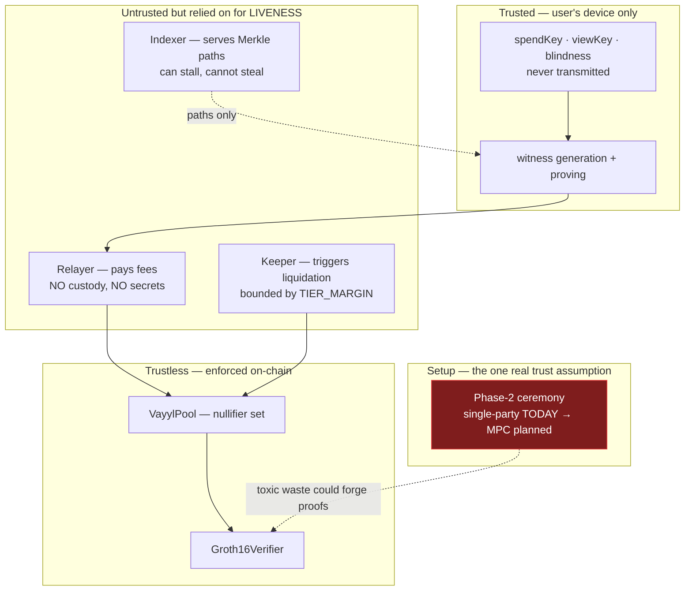

A malicious relayer can censor or delay. It cannot steal, the recipient is bound into the proof (§9.3). A malicious indexer can withhold Merkle paths. It cannot forge them, the root is on-chain. **The only party who could actually break soundness is whoever held the trusted setup**, which is exactly why §19.4 treats the MPC ceremony as a hard prerequisite rather than a nice-to-have.

### 19.2 Test posture

**185+ automated tests green across four toolchains**, 106 Soroban contract tests, 72 circuit soundness cases, plus backend and frontend suites. Contract tests run against the `soroban-sdk` test environment and record `test_snapshots/` JSON.

Adversarial cases assert *rejection*, not merely success:

`unknown_root_rejected` · `changed_recipient_rejected` · `altered_nullifier_rejected` · `double_spend_rejected` · `blocked_nullifier_rejected` · `unfunded_relayer_rejected` · **`same_note_different_privkey_rejected`**

That last is the regression test for the entire soundness class in §5, and it exercises a **real Groth16 proof through a real pairing check**, not a stub.

### 19.3 Invariants that must never regress

1. `gamma ≠ delta` on every registered verification key
2. `(pubX, pubY)` derived from `privKey` in every circuit, never free input
3. `privKey ∈ [1, l)`, enforced by range check, not convention
4. Recipient, relayer, and fee bound into every externally-consequential proof
5. Nullifier marked before value moves
6. `CircuitId` append-only
7. Poseidon2 parameters identical between Circom and `rs-soroban-poseidon`
8. Poseidon V1 never imported
9. Prime-order subgroup membership checked on every received curve point
10. Payout bounded by tracked shielded supply

### 19.4 Trusted setup: stated plainly

Current proving keys derive from a **single-machine Phase-2 setup**, disclosed in the deployment manifests (`"setup": "single-machine testnet proving setup; not a production ceremony"`). It is the weakest claim in the system: whoever ran it holds toxic waste and could in principle forge proofs.

This is why the mainnet pool is a **capped, explicitly-labelled demo**, and why a **multi-party Phase-2 ceremony is a hard prerequisite** (not a nice-to-have) before mainnet holds meaningful value.

The plan is concrete and uses established tooling. Phase 1 is the [Perpetual Powers of Tau](https://medium.com/coinmonks/announcing-the-perpetual-powers-of-tau-ceremony-to-benefit-all-zk-snark-projects-c3da86af8377), a community ceremony any project may fork a contribution from, removing the need to run Phase 1 ourselves. Phase 2 is circuit-specific but comparatively cheap, running roughly **4× faster than Phase 1 with 3× less transmission**. `snarkjs` supports MPC ceremonies **directly in the browser**, with WASM cryptography and worker-thread parallelism, and its formats are compatible with Semaphore's Perpetual Powers of Tau. `snarkjs zkey verify` checks the full contribution chain and prints every intermediate hash.

Target: ≥10 independent contributors, published transcripts and attestations, coordinator tooling open-sourced as a public good for every future ZK project on Stellar.

We would rather state this in our own architecture document than have a reviewer discover it.

### 19.5 Adversarial audit

We commissioned a full adversarial architecture audit against live Stellar ground truth, 14 findings with file-and-line evidence, verified against live CAPs, live network settings, and live mainnet ledger data. Every blocker is remediated in the V2 circuits.

Differential testing against compiled circuit witnesses then caught **two further soundness defects the audit itself missed** (§5). Both fixed, both with regression tests.

An application to the **[Stellar Soroban Audit Bank](https://stellar.org/grants-and-funding/soroban-audit-bank)** for independent third-party review is in preparation. Firms with demonstrated Stellar/Soroban practice (**Zellic** (who audited a Stellar ZK circuit in January 2026), **OtterSec**, **Veridise**, and **Runtime Verification**) are the shortlist, and circuit-specific expertise is a hard selection criterion, not a preference.

---

## 20. Privacy model: what is actually hidden

Any claim stronger than the code supports will be found. Here is the ledger.

| Property | Mechanism | Status |
|---|---|---|
| Sender ↔ recipient unlinkability | Merkle membership + nullifier, in ZK | ✅ Sound, bounded by anonymity-set size |
| Amount confidentiality | Fixed denomination | ✅ Sound, denomination itself is public |
| Note ownership | Poseidon2 commitment, hiding + binding | ✅ Sound |
| Double-spend prevention without revealing the spender | Nullifier set | ✅ Sound |
| Compliance without disclosure | ASP membership in ZK | ✅ Sound |
| Position direction and owner | Tiered commitment scheme | ✅ Sound (§11.3) |
| Order trigger price | Sealed commitment + trigger proof | ✅ Sound |
| **Depositor identity** | n/a | 🔴 **Public**, `require_auth()`; inherent to funds entering |
| **Withdrawal recipient** | n/a | 🔴 **Public**, inherent to funds leaving |
| **Protocol participation** | n/a | 🔴 **Public**, contract ID visible; irreducible on any account-model chain |
| **Timing correlation** | n/a | 🔴 **No defense today**, needs randomized delay + batching |
| **Total volume** | n/a | 🟡 Leaf count monotonic and public; volume ≠ linkage |

**The claim we defend:** *Vayyl hides the link between deposit and withdrawal, the amount, and (for positions) direction and ownership, using Groth16 proofs over BN254, within the anonymity set of the pool. It does not hide that you interacted with Vayyl, when, or that funds entered and left.*

### 20.1 The anonymity set

Cryptography provides unlinkability **within** a set. It cannot manufacture the set. A new pool has a small one, and saying otherwise would be dishonest. This is a volume problem, not a proof problem, with a concrete plan:

1. **Fixed denomination**, collapses amount correlation. ✅ Built.
2. **Enforced minimum anonymity set**, refuse withdrawal below *N* unspent notes.
3. **Randomized withdrawal delay + relayer batching**, kills the timing signature.
4. **Multi-relayer set with client-side random selection**, removes single-fee-payer clustering.
5. **Decoy transactions**, dummy notes that are indistinguishable on-chain, raising the floor independently of organic volume (§21.7).
6. **Publish the live set size in-product**, show users the real number rather than implying privacy they do not have.

---

## 21. Gap analysis: what we do not yet use, and should

*This section exists because a protocol that cannot name its own gaps has not looked for them. Each item states the gap, the production precedent elsewhere, and what adopting it costs.*

### 21.1 Fuzzy Message Detection for note discovery: **HIGH**
**Gap:** Recipients scan every event; cost is linear in total protocol volume.
**Precedent:** [Penumbra runs FMD in production](https://protocol.penumbra.zone/main/crypto/fmd.html). Zcash's full-scan alternative is documented as taking *hours*.
**Adoption:** Add a detection key to the key hierarchy; publish a per-note detection tag; clients trial-decrypt a tunable blurred subset. Composes with our ECDH scheme rather than replacing it.
**Why now:** Correct to build *before* volume makes it urgent. Retrofitting note discovery after users hold notes is a migration, not a feature.

### 21.2 Indexed Merkle tree for nullifiers: **HIGH**
**Gap:** Nullifiers are flat storage entries. Non-membership is a lookup, not a proof, and entries can archive (§18.3).
**Precedent:** [Aztec's indexed Merkle tree](https://docs.aztec.network/developers/docs/foundational-topics/advanced/storage/indexed_merkle_tree); Namada pairs a nullifier tree with its commitment tree.
**Adoption:** Each leaf stores its value plus a pointer to the next-highest, making non-membership a cheap in-circuit proof.
**Why it is the best-value item on this list:** it fixes **three** problems at once, real non-membership proofs, a genuine sparse-tree blocklist replacing the current `asp-non-membership`, and the archival question, because the root lives in instance storage and cannot archive.

### 21.3 Hierarchical viewing keys: **HIGH**
**Gap:** One flat viewing key. Disclosure is all-or-nothing.
**Precedent:** Zcash [ZIP-316](https://zips.z.cash/zip-0316) separates incoming viewing keys, outgoing viewing keys, and full viewing keys, with unified encodings.
**Adoption:** Derive a key tree (spend / full-view / incoming-view / outgoing-view / detect) so an auditor can be granted *incoming* visibility for one asset over one period without spend authority or outgoing visibility.
**Why it matters commercially:** this is the difference between "we have a viewing key" and a compliance product an enterprise can actually adopt.

### 21.4 Proof aggregation and recursion: **MEDIUM**
**Gap:** Every withdrawal costs one full on-chain verification.
**Precedent:** Recursive SNARK composition is standard across rollups; Halo2 uses accumulation for exactly this.
**Adoption:** Aggregate *N* withdrawal proofs into one recursive proof; the pool verifies once. Amortizes verification across a batch and **pairs naturally with the relayer batching that also defeats timing correlation**, one mechanism, two wins.

### 21.5 Multi-asset shielded pool (MASP): **OPEN QUESTION**
**Gap/divergence:** We use per-asset pools; Namada's [MASP](https://github.com/namada-net/masp) gives *"a unified privacy set for all assets."*
**The tension is real.** At low volume, fragmentation is the dominant privacy cost, and MASP is strictly better on that axis. Our reasons for per-asset pools (storage isolation, per-pool anonymity measurement, independent asset policy) are sound but not obviously decisive.
**Decision criterion, stated in advance:** if per-asset anonymity sets stay below a defined floor once multi-asset launches, MASP migration moves from research to roadmap. We would rather publish the criterion than defend the choice reflexively.

### 21.6 Native and GPU proving: **HIGH, cheap**
**Gap:** snarkjs in WASM. Witness generation ~11 s where C++ takes ~1 s.
**Precedent:** [`rapidsnark`](https://zkmopro.org/blog/circom-comparison/) is 4–10× faster; [Mopro](https://zkmopro.org/) ships iOS/Android/React-Native bindings from the same circuits; [ICICLE-Snark](https://github.com/ingonyama-zk/icicle-snark) adds GPU.
**Adoption:** `@vayyl/prover` already abstracts the backend (§14.2), so this is a backend implementation, not a rewrite.
**Why it matters:** it is the difference between a mobile product and a desktop demo.

### 21.7 Decoy notes and timing defenses: **MEDIUM**
**Gap:** No defense against timing correlation (§20).
**Precedent:** Standard across shielded designs; the [IPTF hardened-shielded-pools work](https://iptf.ethereum.org/blog/exploring-hardened-shielded-pools/) treats it as baseline.
**Adoption:** Client-generated dummy notes indistinguishable on-chain, plus randomized delay and relayer batching. Raises the anonymity floor independently of organic volume, the only lever that works on day one of a new pool.

### 21.8 Proof-of-innocence-style attestation: **MEDIUM**
**Gap:** ASP membership is checked at deposit; there is no ongoing per-transaction attestation.
**Precedent:** Railgun's Private Proofs of Innocence proves funds are not from a known-illicit set, at spend time.
**Adoption:** Complements the ASP model (membership at entry, innocence at exit) and strengthens the compliance story for institutional users without weakening privacy for anyone else.

### 21.9 Threshold decryption for liquidation forced-reveal: **UNSOLVED → INTEGRATION PATH**
**Gap:** Forced reveal of an insolvent position after a missed heartbeat needs threshold decryption by a keeper committee. No library hands this over for free, and we have said so consistently.
**New finding:** **[Fairblock](https://fairblock.network/) is live on Stellar** providing *"confidential transaction infrastructure… using threshold encryption"* for exactly this class of problem, and **Sanctum** ([zkbricks/mpc-zexe](https://github.com/zkbricks/mpc-zexe)) brings ZK+MPC computation over secret state to Stellar.
**Adoption:** Evaluate integration rather than building a threshold committee ourselves. This turns a named unsolved research problem into a scoped ecosystem integration, and integrating an existing Stellar project is a better outcome for the ecosystem than duplicating it.

### 21.10 Proof-system re-evaluation gated on CAP-0080: **WATCHING**
**Gap:** Groth16 needs a per-circuit ceremony (§4.1).
**Trigger:** [CAP-0080](https://github.com/stellar/stellar-protocol/blob/master/core/cap-0080.md) ("efficient ZK BN254 use cases," Implemented, Protocol 26) may change the MSM cost profile that drove the original decision. If it does, PLONK's universal setup becomes attractive for *future* circuits, every new circuit added without a new ceremony.
**Containment:** because all circuits resolve through one verifier, a second proof system can be introduced behind a new `CircuitId` range without disturbing anything deployed.

### 21.11 Transaction monitoring (KYT): **MEDIUM**
**Gap:** ASP allow/deny lists are static sets. There is no behavioural screening.
**Precedent:** xBull Mixer on Stellar pairs privacy pools with **Know-Your-Transaction** monitoring to filter tainted funds, a materially deeper compliance posture than list membership alone.
**Adoption:** Feed KYT signals into ASP set maintenance rather than into the protocol, keeping the on-chain surface unchanged while strengthening what membership *means*.

### 21.12 Automated circuit analysis and formal methods: **HIGH, cheap**
**Gap:** Our soundness bugs were found by hand-written differential testing. That worked, and it does not scale.
**Precedent:** `circomspect` (static analysis for underconstrained signals), Picus/Ecne (formal underconstraint detection) and Komet fuzzing, which Runtime Verification used on a Stellar protocol audit.
**Adoption:** Wire `circomspect` into CI as a required check; add Komet fuzzing to the contract suite.
**Why it belongs at the top of the list:** an underconstrained-signal detector in CI is precisely the tool that would have caught both defects in §5 automatically, and it costs a day to wire up.

### 21.13 Account abstraction and agent spending policies: **MEDIUM**
**Gap:** Freighter only. Agents cannot hold scoped, policy-bounded shielded spend authority.
**Precedent:** OpenZeppelin smart-account contracts on Stellar support spending limits and programmable policies, and SDF names them as the path to agents operating within defined budgets.
**Adoption:** Pairs directly with §13, a confidential agent wallet with an on-chain spending policy is the missing piece between "agents can pay privately" and "a business will let its agents pay privately."

---

## 22. Roadmap

| Phase | Scope | State |
|---|---|---|
| **Shipped** | BN254 verifier · shielded pool · ASP membership · deposit / withdraw / **shielded-to-shielded transfer** · rage-quit · relayer · indexer · production DApp · **mainnet deployment** | ✅ |
| **Phase 1** | Multi-denomination pools · multi-relayer + timing defenses · anonymity-set floor · selective disclosure · public testnet | 📐 |
| **Phase 2** | Multi-asset pools (USDC) · **Vayyl SDK** (§14) · **Private Positions + counterparty vault** (§11) · x402 confidential facilitator (§13) · **multi-party trusted-setup ceremony** (§19.4) | 📐 |
| **Phase 3** | Independent audit remediation · full mainnet suite · **Hidden Conditional Orders** (§12) · production operations · professional user testing | 📐 |
| **Phase 4** | Gap-analysis adoption: FMD note discovery · indexed nullifier tree · hierarchical viewing keys · native/GPU proving · decoy notes (§21) | 📐 |

### 22.1 Confidential Batch Disbursement: payroll and treasury 📐

*A new capability, and the most direct route to enterprise revenue.*

Today a company paying 200 employees privately submits 200 transfers. Visible: exactly 200 payments, at one moment, from one entity. **The count and the timing leak the payroll even when every amount is hidden.**

`batch_transfer` takes one shielded input note and produces *N* output commitments in a single proof, with one nullifier and one on-chain verification.

```
PUBLIC:   root, nullifier, output_commitments[N], ephemeral_keys[N], batch_binding
PRIVATE:  privKey, blindness, path, per-recipient amounts and blindings

CONSTRAINTS:
  Note() ownership + Merkle inclusion of the input
  Σ output_amounts + fee === input_amount        // value conservation, range-checked
  each output commitment well-formed
  batch_binding pins the full output set — no substitution
```

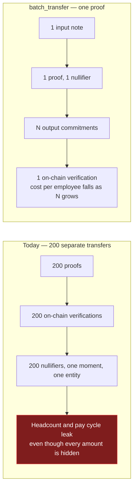

Value conservation returns as an explicit constraint here (unlike §9.2), so every amount is range-checked, non-negotiable, since this is where an underconstrained signal would mint money.

Why it matters: **payroll is the single most-cited use case in Stellar's own privacy documentation**, and it is the flow institutional users ask for first. Batching also amortizes verification across *N* recipients, so per-employee cost falls as the batch grows. Pairs naturally with §21.4.

### 22.2 Confidential Credit and Solvency Attestation 📐

*The clearest demonstration that Vayyl is infrastructure rather than an app.*

An on-chain lender must currently see a borrower's balances to price risk. `solvency_attest` proves a statement (*"I control shielded notes totalling at least X"*, or *"my position's health ratio exceeds T"*) without revealing balances, positions, or identity.

The lender calls `verify(CircuitId::SolvencyAttest, …)` and receives a boolean. It writes no circuits and runs no prover.

Composes directly with §11's position health proofs and with the `vayyl.attest_solvency` capability in §13, the same primitive serves human borrowers and autonomous agents. Undercollateralized lending against private creditworthiness is a category that does not exist on Stellar today.

### 22.3 Cross-chain confidential settlement 🔬

Because Vayyl proofs are ordinary BN254 Groth16 proofs, **the same proof artifact verifies on Stellar and on Ethereum or any EVM L2** via the EIP-196/197 precompiles that CAP-0074 mirrors. A shielded note proved on Stellar can be recognized by an EVM verifier without a bridge, a wrapped asset, or a trusted relay of the *proof* itself. Settlement still requires an asset path, but the confidentiality layer becomes chain-portable.

This is a structural property of the curve choice in §1.1, and BLS12-381 designs cannot follow.

### 22.4 Research track 🔬

Confidential multi-leg baskets (hedged multi-asset strategies revealing only aggregate health) · confidential track records (prove a performance statistic without revealing a trade) · threshold-keeper liquidation (§21.9) · batch sealed-bid uniform-price clearing · **continuous private matching**, a true dark pool, where SDF's own [MPC / FHE / TEE comparison](https://stellar.org/blog/developers/building-a-dark-pool-on-stellar-mpc-fhe-and-tees-compared) is the reference analysis and Arcium's Solana MPC deployment is the closest production precedent. No dates claimed on any of these.

---

## 23. Deployments

### Mainnet: since 11 July 2026

**Read this before the table.** The July 2026 mainnet deployment is a **deliberately capped demonstration, not the production launch.** It exists to prove one thing: that Groth16 verification over BN254 executes on Stellar mainnet inside the real instruction budget, at a real, measured cost. It does that, and the cost figures in §18.1 come from it.

What it is not: the pool was deployed under the **single-party Phase-2 setup** described in §19.4, using the pre-correction V1 circuits that predate the key-binding fix in §5.1. It holds a nominal balance, has been used only by the deploying account, and is not reachable from the application, which is hardcoded to testnet. `deployments/mainnet-vault-v1.json` carries `"demo_only": true` and `"trusted_setup": "single-party handover artifacts; hackathon demo only"`, and those flags are the authority.

It is scheduled for formal retirement, replaced by contracts using verification keys derived from the multi-party ceremony in §19.4. We publish the contract IDs below because a claim about mainnet cost is worthless without the transactions behind it, not because this deployment should be mistaken for a live product.

| Component | Contract ID |
|---|---|
| Shielded XLM pool | [`CB2NWPFWW5YLD6UYWR4RFERECSMBF6SB62P7RRP2LF2P2EMDSDLAZ3OW`](https://stellar.expert/explorer/public/contract/CB2NWPFWW5YLD6UYWR4RFERECSMBF6SB62P7RRP2LF2P2EMDSDLAZ3OW) |
| Groth16 / BN254 verifier | [`CATKJ2WBLQXGNVMGZ6E4JEZVTRMVJO2SKA3H7VH53TVD2HJPSBQ46MRD`](https://stellar.expert/explorer/public/contract/CATKJ2WBLQXGNVMGZ6E4JEZVTRMVJO2SKA3H7VH53TVD2HJPSBQ46MRD) |
| ASP membership | [`CBJWADSNYX52I6GEASN5P7MS6NWQ4O5WWQJOPTNSKCRHYTK2BYET6YB3`](https://stellar.expert/explorer/public/contract/CBJWADSNYX52I6GEASN5P7MS6NWQ4O5WWQJOPTNSKCRHYTK2BYET6YB3) |
| ASP non-membership | `CBJSFSZOEOEBSBTUZPTFZNAMP37PU7GKVFRERYSBTMYY7KPG6QKMAAQE` |
| Native XLM SAC | `CAS3J7GYLGXMF6TDJBBYYSE3HQ6BBSMLNUQ34T6TZMYMW2EVH34XOWMA` |

VK registration transactions: `c4f2092ded23035d02406af72635b55ed100158ba6b2a85556192fb0c3e6e011` (Deposit) · `4331b65e2bd9c1821f0775c9c4c5a9eba37f438372bd2762445f407dd063d7a6` (Withdraw). WASM hashes and artifact digests in `deployments/mainnet-vault-v1.json`.

### Testnet: Vault V2

| Component | Contract ID |
|---|---|
| Fixed-denomination pool | `CB6XFHGN4DMVEQRESJHPOUNYLUCGMOZTAIKTWH3I7KT3NVW2XY4NIOLC` |
| Groth16 verifier | `CBRMDGEMQERFTG3MCBHYPHMZPKVMDYFGHJAMREQW23ZDKVAMAFDRJ2J5` |
| ASP membership | `CD5DLTOIEAYA6CATHKELFAYRBOEFQN5TMADCEAURVZMMTYVD6Y5POCMO` |
| ASP non-membership | `CAYNUQUPVQF7K35LG4VKNBFUHVULAKN27CDBP4N7EVXXEAGICWVYB4WD` |

The full `shield → private transfer → recipient discovery → withdraw` cycle has been verified twice against this live stack. Per-wallet deposit transaction hashes and adversarial-rejection results are committed in `deployments/testnet-vault-v2-evidence.json`.

### Repository

`github.com/SATISH-JALAN/Vayyl`, four toolchains, no single top-level build.

| Path | Contents |
|---|---|
| `contracts/` | Cargo workspace, one crate per Soroban contract, `#![no_std]`, `wasm32v1-none` |
| `circuits/` | Circom sources + compile / Phase-2 / proof-generation tooling |
| `backend/` | Indexer, relayer, oracle adapter, keeper (TypeScript) + proof bridge (Rust) |
| `frontend/` | Marketing site + DApp (React, Zustand, Freighter, Web Worker proving) |
| `rs-soroban-poseidon/` | Vendored Poseidon2 crate, the parameter authority |
| `deployments/` | Deployment manifests, artifact hashes, on-chain evidence |

---

## 24. References

**Stellar protocol**
[CAP-0059 BLS12-381](https://github.com/stellar/stellar-protocol/blob/master/core/cap-0059.md) ·
[CAP-0074 BN254](https://github.com/stellar/stellar-protocol/blob/master/core/cap-0074.md) ·
[CAP-0075 Poseidon2](https://github.com/stellar/stellar-protocol/blob/master/core/cap-0075.md) ·
[CAP-0080 efficient ZK BN254](https://github.com/stellar/stellar-protocol/blob/master/core/cap-0080.md) ·
[CAP-0082 checked 256-bit arithmetic](https://github.com/stellar/stellar-protocol/blob/master/core/cap-0082.md) ·
[CAP-0062](https://github.com/stellar/stellar-protocol/blob/master/core/cap-0062.md) ·
[CAP-0066](https://github.com/stellar/stellar-protocol/blob/master/core/cap-0066.md) ·
[Software versions, Protocol 25, mainnet 22 Jan 2026](https://developers.stellar.org/docs/networks/software-versions)

**Stellar documentation and research**
[Privacy on Stellar](https://developers.stellar.org/docs/build/apps/privacy) ·
[ZK Proofs on Stellar](https://developers.stellar.org/docs/build/apps/zk) ·
[Agentic Payments](https://developers.stellar.org/docs/build/agentic-payments) ·
[x402 on Stellar](https://developers.stellar.org/docs/build/agentic-payments/x402) ·
[Built on Stellar x402 Facilitator](https://developers.stellar.org/docs/build/agentic-payments/x402/built-on-stellar) ·
[MPP on Stellar](https://developers.stellar.org/docs/build/agentic-payments/mpp) ·
[Oracle providers, Reflector](https://developers.stellar.org/docs/data/oracles/oracle-providers#reflector-network) ·
[State archival](https://developers.stellar.org/docs/learn/fundamentals/contract-development/storage/state-archival) ·
[Prototyping Privacy Pools on Stellar](https://stellar.org/blog/ecosystem/prototyping-privacy-pools-on-stellar) ·
[Building a Dark Pool on Stellar: MPC, FHE, and TEEs Compared](https://stellar.org/blog/developers/building-a-dark-pool-on-stellar-mpc-fhe-and-tees-compared) ·
[Developer Preview: Confidential Tokens on Stellar](https://stellar.org/blog/developers/developer-preview-confidential-tokens-on-stellar) ·
[Privacy on open blockchains: framing the problem](https://stellar.org/blog/policy/privacy-on-open-blockchains-framing-the-problem) ·
[Announcing Stellar X-Ray, Protocol 25](https://stellar.org/blog/developers/announcing-stellar-x-ray-protocol-25)

**Cross-chain prior art**
[Privacy Pools whitepaper, Buterin, Illum, Nadler, Schär, Soleimani](https://privacypools.com/whitepaper.pdf) ·
[0xbow](https://0xbow.io/) ·
[Aztec indexed Merkle tree](https://docs.aztec.network/developers/docs/foundational-topics/advanced/storage/indexed_merkle_tree) ·
[Namada MASP](https://github.com/namada-net/masp) ·
[Penumbra Fuzzy Message Detection](https://protocol.penumbra.zone/main/crypto/fmd.html) ·
[Oblivious Message Retrieval, Liu & Tromer](https://eprint.iacr.org/2021/1256.pdf) ·
[PerfOMR (USENIX Security '24)](https://www.usenix.org/system/files/usenixsecurity24-liu-zeyu.pdf) ·
[Zcash ZIP-316 Unified Viewing Keys](https://zips.z.cash/zip-0316) ·
[Railgun docs](https://docs.railgun.org/wiki/learn/using-private-tokens) ·
[Solana Confidential Transfers](https://solana.com/docs/tokens/extensions/confidential-transfer) ·
[Arcium](https://messari.io/report/arcium-mainnet-alpha-release) ·
[Exploring Hardened Shielded Pools, IPTF](https://iptf.ethereum.org/blog/exploring-hardened-shielded-pools/)

**Tooling and ceremony**
[Perpetual Powers of Tau](https://medium.com/coinmonks/announcing-the-perpetual-powers-of-tau-ceremony-to-benefit-all-zk-snark-projects-c3da86af8377) ·
[snarkjs](https://github.com/iden3/snarkjs) ·
[Setup Ceremonies, ZKProof Standards](https://zkproof.org/2021/06/30/setup-ceremonies/) ·
[Mopro, Circom prover comparison](https://zkmopro.org/blog/circom-comparison/) ·
[ICICLE-Snark](https://github.com/ingonyama-zk/icicle-snark) ·
[Soroban Audit Bank](https://stellar.org/grants-and-funding/soroban-audit-bank)

---

*Vayyl is built by Valdyum Labs as original implementation from first principles, no forked shielded-pool codebase, no copied verifier. Last updated 10 August 2026.*
