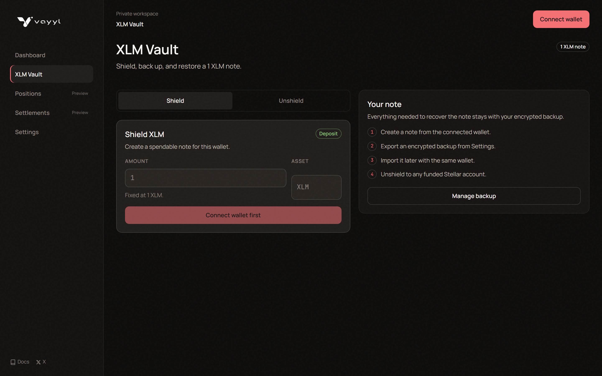
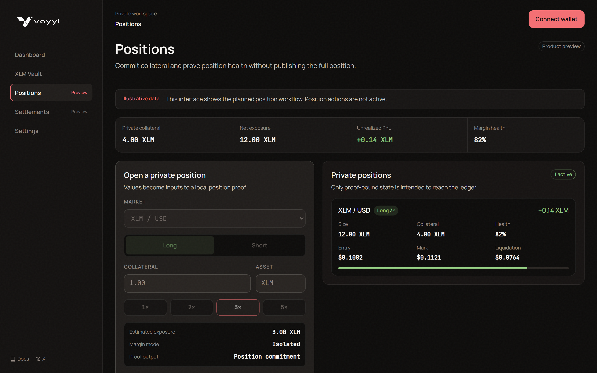
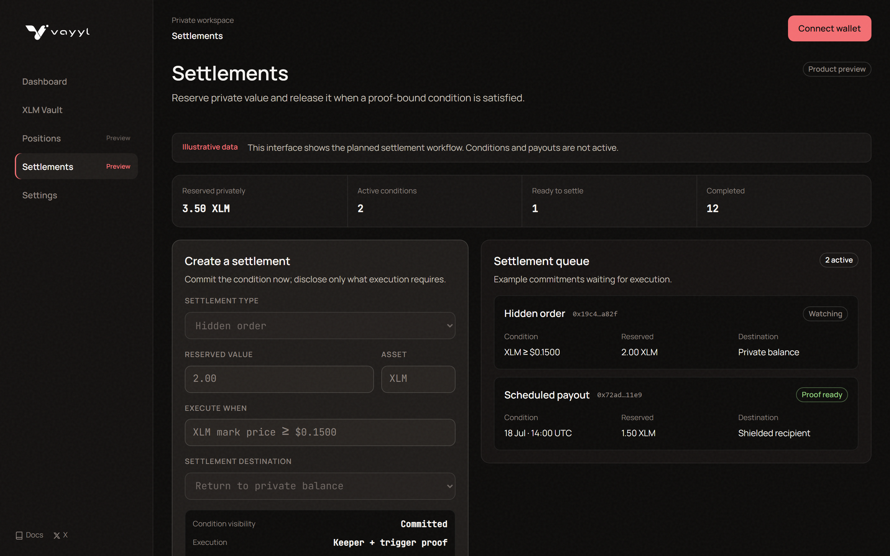
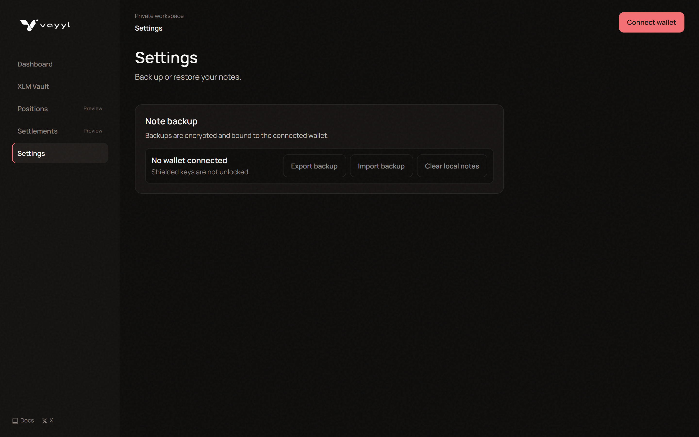
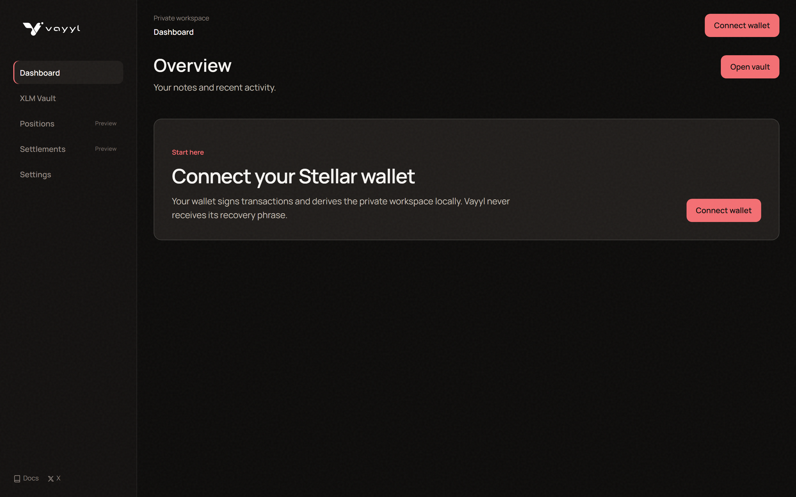
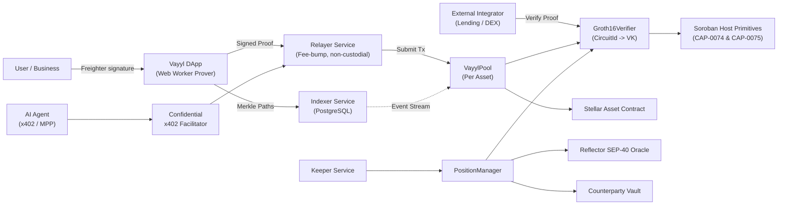
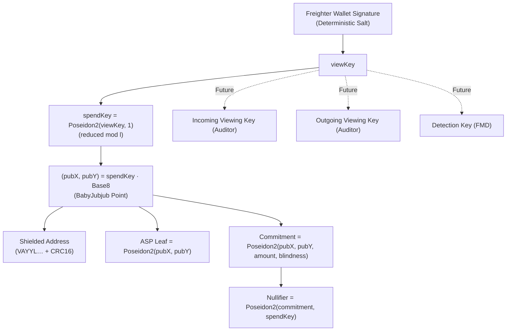
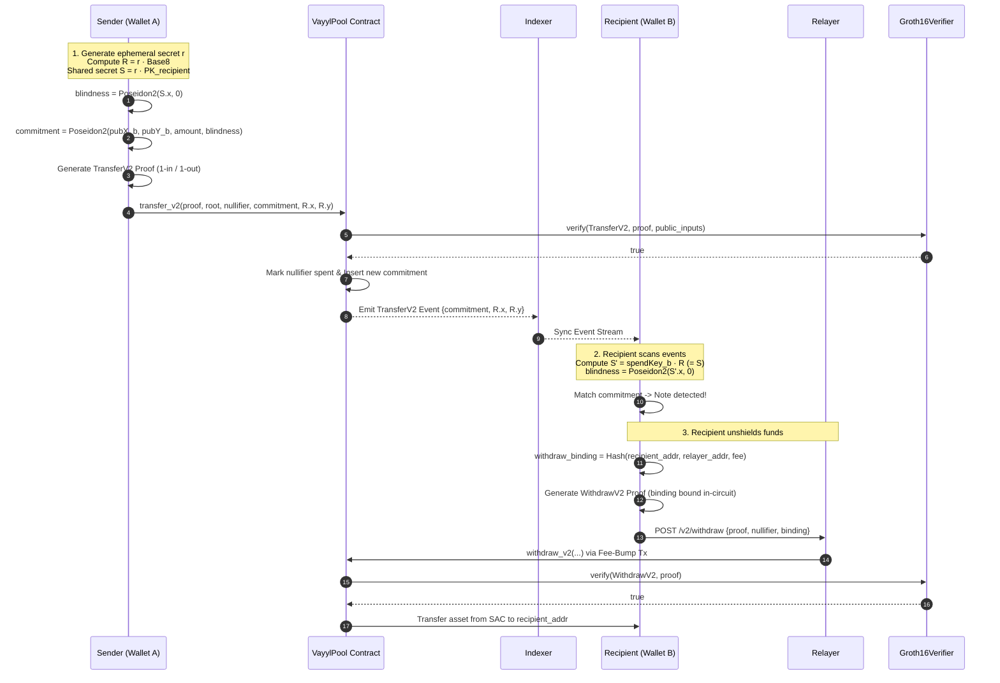
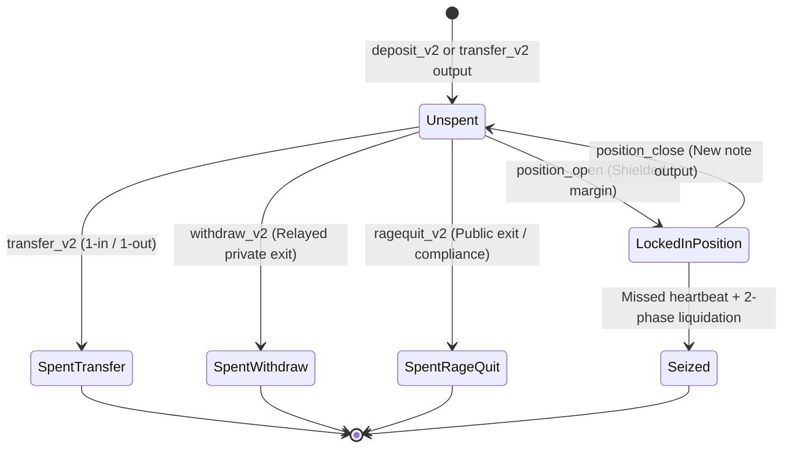

# Vayyl — Confidential Settlement Infrastructure for Stellar

<div align="center">

[](https://stellar.org)
[](https://github.com/stellar/stellar-protocol/blob/master/core/cap-0074.md)
[-FF0080)](https://github.com/stellar/stellar-protocol/blob/master/core/cap-0075.md)
[-00DF8F)](https://stellar.expert/explorer/public/contract/CB2NWPFWW5YLD6UYWR4RFERECSMBF6SB62P7RRP2LF2P2EMDSDLAZ3OW)
[-informational)](https://stellar.expert/explorer/testnet/contract/CB6XFHGN4DMVEQRESJHPOUNYLUCGMOZTAIKTWH3I7KT3NVW2XY4NIOLC)
[](#license)

**Prove a settlement is valid without publishing the underlying amount, identity, or trading strategy.**

[Live Application](https://vayyl.vercel.app) • [Architecture Specification](ARCHITECTURE.md) • [Demo Video](https://youtu.be/asV0turS_rk?si=Iaeu-0j0v0uxEidR) • [Transaction Evidence](https://drive.google.com/drive/folders/1FnvSYiqEZ97zV_dEbVh4H1qMtTKeHpE7?usp=drive_link) • [Community & X](https://x.com/Vayylstellar)

</div>

---

## Overview

**Vayyl** is a zero-knowledge confidential settlement protocol built natively for **Stellar Soroban**.

By leveraging native Soroban host functions introduced in Protocol 25 & 26 ([CAP-0074](https://github.com/stellar/stellar-protocol/blob/master/core/cap-0074.md) BN254 curve operations and [CAP-0075](https://github.com/stellar/stellar-protocol/blob/master/core/cap-0075.md) Poseidon2 permutations), Vayyl provides high-performance, cost-effective zero-knowledge settlement primitives. Users, institutions, and autonomous AI agents can execute confidential transfers, open shielded positions, and settle conditional escrows while verifying on-chain constraints at deterministic sub-cent costs.

---

## 🎥 Video Walkthrough & Demo

Watch the comprehensive video demonstration illustrating the full lifecycle of shielded deposits, private transfers with ephemeral-key ECDH discovery, unshielding with front-running protection, and on-chain verification on Stellar Soroban:

<div align="center">

[](https://youtu.be/asV0turS_rk?si=Iaeu-0j0v0uxEidR)

**[▶️ Click to Watch the Vayyl Protocol Demonstration on YouTube](https://youtu.be/asV0turS_rk?si=Iaeu-0j0v0uxEidR)**

</div>

---

## 📸 Protocol Interface Tour

<div align="center">

### 1. Landing & Narrative Interface
*The entry point introducing Vayyl's confidential settlement architecture, live empirical metrics, and protocol mechanisms.*


---

### 2. Shielded Pool (Deposit, Transfer, Withdraw & Rage-Quit)
*The core private payment interface. Generate client-side Groth16 proofs in Web Workers, transfer notes via ephemeral ECDH discovery, and unshield via relayers without revealing source commitments.*



---

### 3. Private Positions & Leverage Attestation
*Open and maintain leveraged positions with shielded collateral. Submit periodic zero-knowledge health attestations against Reflector SEP-40 oracle prices without revealing balance or position direction.*



---

### 4. Conditional Orders & Sealed Escrow
*Commit hidden limit orders and conditional escrows on-chain. Orders remain sealed until trigger condition proofs are submitted and executed.*



---

### 5. Shielded Identity & Compliance Controls
*Derive BabyJubjub shielded identities deterministically from Freighter wallet signatures. Manage encrypted note backups and check Association Set Provider (ASP) compliance status.*



---

### 6. Protocol Analytics & Verification Dashboard
*Real-time protocol transparency metrics displaying live contract states, verified on-chain executions, and cryptographic verifier activity.*



</div>

---

## 📊 Traction & Empirical Verification

Vayyl is deployed and executing on **Stellar Mainnet** and **Testnet**. All metrics below are independently verifiable from on-chain contract addresses and public transaction ledgers.

Across both networks, Vayyl has executed **153 verified contract invocations across 18 deployed contracts**. Every invocation maps to a named protocol capability rather than generic infrastructure filler.

| Metric | Mainnet (Live since 11 July 2026) | Testnet (3 Deployment Generations) | Combined Total |
| :--- | :--- | :--- | :--- |
| **Deployed Contracts** | 4 contracts | 14 contracts | **18 contracts** |
| **Verified Invocations** | 19 contract calls | 134 contract calls | **153 invocations** |
| **Active Test Wallets** | 1 wallet (bounded demo) | 9 wallets (team test accounts) | **10 wallets** |
| **Proving Mechanism** | Native Soroban BN254 Groth16 | Native Soroban BN254 Groth16 | **End-to-End ZK** |
| **Steady-State Deposit Fee** | `~0.0144 XLM` (143,769 - 143,894 stroops) | Sub-cent testnet execution | **Empirically measured** |
| **Steady-State Withdraw Fee** | `0.0274 XLM` (274,053 stroops) | Sub-cent testnet execution | **Deterministic cost** |

### Mainnet Deployments & Proving Costs
* **Shielded Pool:** [`CB2NWPFWW5YLD6UYWR4RFERECSMBF6SB62P7RRP2LF2P2EMDSDLAZ3OW`](https://stellar.expert/explorer/public/contract/CB2NWPFWW5YLD6UYWR4RFERECSMBF6SB62P7RRP2LF2P2EMDSDLAZ3OW)
* **Groth16 / BN254 Verifier:** [`CATKJ2WBLQXGNVMGZ6E4JEZVTRMVJO2SKA3H7VH53TVD2HJPSBQ46MRD`](https://stellar.expert/explorer/public/contract/CATKJ2WBLQXGNVMGZ6E4JEZVTRMVJO2SKA3H7VH53TVD2HJPSBQ46MRD)
* **ASP Membership:** [`CBJWADSNYX52I6GEASN5P7MS6NWQ4O5WWQJOPTNSKCRHYTK2BYET6YB3`](https://stellar.expert/explorer/public/contract/CBJWADSNYX52I6GEASN5P7MS6NWQ4O5WWQJOPTNSKCRHYTK2BYET6YB3)
* **ASP Non-Membership:** [`CBJSFSZOEOEBSBTUZPTFZNAMP37PU7GKVFRERYSBTMYY7KPG6QKMAAQE`](https://stellar.expert/explorer/public/contract/CBJSFSZOEOEBSBTUZPTFZNAMP37PU7GKVFRERYSBTMYY7KPG6QKMAAQE)

> **Ecosystem Cost Benchmark:** Vayyl delivers the first published empirical costs of Groth16 verification on Stellar Mainnet. Compared to optimized Noir UltraHonk verification on Soroban (~`0.09 XLM`), Vayyl's BN254 Groth16 verification costs are **3x to 6x lower**.

### 8 Protocol Capabilities Executed End-to-End On-Chain
1. **Shielded Deposit:** 15 testnet executions + 7 mainnet executions (22 total).
2. **Private Shielded-to-Shielded Transfer:** Ephemeral-key ECDH recipient discovery without publishing ciphertexts.
3. **Unshield to Arbitrary Recipient:** Relayer-submitted with zero user address linkage and front-running defeat.
4. **ASP Compliance Enrollment:** Merkle-tree membership insertion and in-circuit proof verification.
5. **Private Position Open:** Zero-knowledge margin commitment without revealing size or direction.
6. **Private Health Attestation:** In-circuit proof against Reflector SEP-40 oracle feeds.
7. **Completed Two-Phase Liquidation:** `initiate_liquidation` followed by `reveal_and_seize`.
8. **Hidden Conditional Order & Agentic Settlement:** Sealed order committed, proved, and settled; agentic settlement quest authorized and paid out.

* **Independent Verification Ledger:** [Google Drive Evidence Folder](https://drive.google.com/drive/folders/1FnvSYiqEZ97zV_dEbVh4H1qMtTKeHpE7?usp=drive_link) — Complete logs of all 153 transactions with transaction hashes, contract addresses, function names, timestamps, and explorer links.

---

## 🏛️ System Architecture

Vayyl is structured as a six-layer modular settlement stack where each layer depends strictly on the layers beneath it.

```
┌──────────────────────────────────────────────────────────────────┐
│ L5  CLIENT        Browser DApp · Freighter · Web Worker proving  │
│                   IndexedDB note vault · encrypted note backup   │
├──────────────────────────────────────────────────────────────────┤
│ L4  SERVICES      Indexer · Relayer · Oracle adapter · Keeper    │
│                   Proof bridge (snarkjs JSON → Soroban binary)   │
├──────────────────────────────────────────────────────────────────┤
│ L3  APPLICATION   PositionManager · LiquidationEngine            │
│                   HiddenOrderRegistry · AgenticSettlementHub     │
├──────────────────────────────────────────────────────────────────┤
│ L2  CORE          VayylPool (per asset) · VayylPoolFactory       │
│                   ASPMembership · ASPNonMembership · Vault       │
├──────────────────────────────────────────────────────────────────┤
│ L1  VERIFICATION  Groth16Verifier — CircuitId → VerificationKey  │
│                   ONE registry, callable by any Soroban contract │
├──────────────────────────────────────────────────────────────────┤
│ L0  STELLAR HOST  bn254_g1_add · bn254_g1_mul                    │
│                   bn254_multi_pairing_check · Poseidon2          │
│                   Stellar Asset Contract · Reflector SEP-40      │
└──────────────────────────────────────────────────────────────────┘
```

### System Context & Actor Flow



---

## 🔐 Cryptographic Foundation

### 1. Key Derivation & Note Primitive

Every payment, position, and order in Vayyl descends deterministically from a single Freighter wallet signature:



* **In-Circuit Public Key Derivation:** `(pubX, pubY)` is strictly computed *inside the circuit* from `spendKey` using BabyJubjub scalar multiplication and never accepted as free prover input. This mathematically prevents arbitrary nullifier creation for a single note.
* **Range Checks & Subgroup Constraints:** `spendKey ∈ [1, l)` where `l ≈ 2^251.3` (the `Base8` subgroup order) is strictly checked via `Num2Bits(251)` to eliminate alternative witness generation.

---

### 2. Private Payments & Ephemeral ECDH Discovery



* **No Encrypted Ciphertexts On-Chain:** Note transfer uses ephemeral Diffie-Hellman on BabyJubjub. The sender posts `(R.x, R.y)` as public inputs, and the recipient reconstructs the blindness secret locally.
* **Front-Running Immunity:** In `withdraw_v2`, `withdraw_binding` cryptographically binds `recipient`, `relayer`, and `fee`. If an attacker intercepts the proof from the mempool and attempts to replace the recipient address, the on-chain verifier rejects the proof.

---

### 3. Note Lifecycle & Exit Paths



* **Rage-Quit Compliance Escape Hatch:** If an Association Set Provider (ASP) delists an account after funds are shielded, the user can execute `ragequit_v2`. This publishes the deposit-to-payout link and recovers funds publicly without stranding capital. Both `withdraw_v2` and `ragequit_v2` consume the exact same nullifier.

---

## 🛠️ Repository Structure

Vayyl consists of four independent, decoupled toolchains:

```
Vayyl/
├── frontend/                 # Next.js 16 App Router + Client React DApp (/app)
│   ├── src/app/              # Marketing & Narrative landing page
│   ├── src/dapp/             # Shielded Pool, Positions, Escrow, Settings views
│   ├── src/lib/              # Prover, Web Worker bridge, note cryptography
│   └── public/circuits/      # Compiled WASM provers and final zkey artifacts
│
├── contracts/                # Rust Soroban Smart Contracts (no_std, wasm32)
│   ├── groth16-verifier/     # Centralized CircuitId -> VK verification engine
│   ├── vayyl-pool/           # Per-asset Merkle accumulator, deposit/transfer/withdraw
│   ├── vayyl-pool-factory/   # Multi-asset pool deployer
│   ├── asp-membership/       # Allowed set Merkle tree verifier
│   ├── asp-non-membership/   # Restricted set exclusion verifier
│   ├── position-manager/     # Private position open, health attestation, close
│   ├── liquidation-engine/   # 2-phase liquidation heartbeat & seize engine
│   ├── hidden-order-registry/# Sealed limit orders & trigger proof settlement
│   ├── agentic-settlement-hub/# AI agent x402 settlement & reward hub
│   └── vayyl-types/          # Shared cryptographic types & ABIs
│
├── circuits/                 # Circom 2.1 zero-knowledge circuits
│   ├── deposit_v2.circom     # Shielded deposit + ASP membership (2 inputs)
│   ├── transfer_v2.circom    # 1-in / 1-out private transfer (5 inputs)
│   ├── withdraw_v2.circom    # Unshield with front-running binding (3 inputs)
│   ├── ragequit_v2.circom    # Public exit escape hatch (3 inputs)
│   ├── position_open.circom  # Shielded position creation (4 inputs)
│   ├── position_health.circom# Oracle price attestation (4 inputs)
│   ├── position_close.circom # Position settlement (6 inputs)
│   └── lib/                  # Note, Poseidon2, BabyJubjub, Merkle primitives
│
├── backend/                  # Off-chain supporting services
│   ├── indexer/              # Real-time event indexer & Merkle tree DB (Node/TS)
│   ├── relayer/              # Non-custodial fee-bump transaction submitter
│   ├── keeper/               # Automated liquidation & order watcher
│   ├── oracle-adapter/       # SEP-40 Reflector price feed bridge
│   └── proof-bridge/         # Rust snarkjs JSON to Soroban binary translator
│
└── deployments/              # Deployment manifests and Merkle tree snapshots
```

---

## ⚡ Quickstart & Local Setup

### Prerequisites
* **Node.js**: v20+
* **Package Manager**: `pnpm` (v9+)
* **Rust**: `nightly` with `wasm32-unknown-unknown` target
* **Stellar CLI**: `stellar-cli` v22+
* **Wallet**: Freighter extension configured for Stellar Testnet

---

### 1. Run the Frontend DApp

```bash
# Navigate to frontend
cd frontend

# Install dependencies
pnpm install

# Configure testnet environment
cp .env.testnet .env.local

# Start Next.js Turbopack dev server
pnpm dev
```

* Open `http://localhost:3000` for the Protocol Landing Page.
* Open `http://localhost:3000/app?view=pool` for the Shielded Pool DApp.

> *Note: Proof generation executes in a dedicated Web Worker to maintain UI responsiveness.*

---

### 2. Run Local Indexer & Relayer

```bash
# Start Indexer (Terminal 1)
cd backend/indexer
pnpm install
pnpm dev

# Start Relayer (Terminal 2)
cd backend/relayer
pnpm install
pnpm dev
```

---

### 3. Verify Circuits & Merkle Trees

```bash
# Navigate to circuits
cd circuits

# Verify committed Merkle leaf tree snapshot against testnet pool
pnpm snapshot:verify

# Run circuit unit tests
pnpm test
```

---

### 4. Build and Test Soroban Contracts

```bash
# Run all contract unit tests (including real-proof verifications)
cargo test --workspace

# Build optimized WASM binaries
cargo build --workspace --target wasm32-unknown-unknown --release
```

---

## 🔒 Security Invariants & Honesty Boundaries

1. **`gamma != delta` Verifier Enforcement:** `Groth16Verifier` explicitly checks and rejects any verification key where $\gamma = \delta$. This structurally eliminates the vulnerability that compromised Veil Cash and FoomCash.
2. **Poseidon V1 Ban:** Poseidon V1 is strictly forbidden across all circuits and contracts due to the variable-length zero-padding collision vulnerability (CVE-2026-32129). Vayyl exclusively uses Poseidon2 permutations.
3. **Phase-2 Trusted Setup Notice:** The current Testnet and Mainnet demo proving keys were generated using a single-machine Phase-2 ceremony. Production mainnet deployments holding material user assets require an open, multi-party ceremony.
4. **Testnet / Audit Status:** Vault V1 is live on Mainnet as a bounded proof-of-concept. Contracts are under continuous testing and have not yet undergone external third-party security audits.

---

## 📜 License

Licensed under either of:

* Apache License, Version 2.0 ([LICENSE-APACHE](LICENSE-APACHE) or http://www.apache.org/licenses/LICENSE-2.0)
* MIT license ([LICENSE-MIT](LICENSE-MIT) or http://opensource.org/licenses/MIT)

at your option.

---

<div align="center">
Built with ⚡ for the <strong>Stellar Soroban</strong> Ecosystem.
</div>
